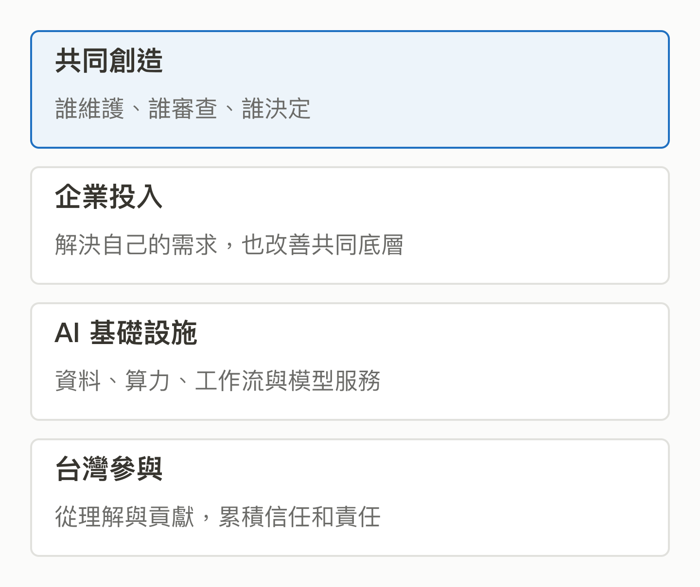

# TAIONE 圖解書

## 從開源怎麼運作，看懂 11 個 AI 基礎設施 Track

**企業為什麼付錢維護人人可用的軟體？台灣為什麼要培養能參與這些專案的人？** 這本圖解書從這兩個問題出發，帶你認識共同基礎設施、背後的企業與社群，以及 TAIONE Fellowship 想促成的改變。

| [**開始閱讀 →**](chapters/01-ai-service.md) | [**直接看 11 個 Track**](#track-目錄) | [**查看來源**](SOURCES.md) |
| :---: | :---: | :---: |

*從開源運作，走到技術影響力。看懂各個角色，才看得懂計畫意圖。* [開啟 SVG 原圖](assets/figures/cover.svg)

這是一本**獨立撰寫的公開導讀**，不是 TAIONE 或各上游專案的官方文件。計畫及 Track 名單以 [TAIONE 官方網站](https://taione.org/fellowship/tracks)為準。資料查核日：**2026-09-18**。

## 這本書適合誰？

你知道 AI 應用可以做什麼，但還不熟悉開源專案由誰維護、企業為何投入，或 Kubernetes、Kafka、vLLM 等工具如何影響日常服務，就可以從第一章開始。每章先給情境，再用圖解說明機制；不需要先會 Rust、Scala 或叢集部署。

讀完後，你應能分清「使用某個專案」與「參與它的技術決策」，也能說明這 11 個方向各自處理的問題。這能幫助你理解計畫及選擇想深入的題目；不保證讀完即具備維護能力。

## 閱讀目錄

每章頂部與底部都有 **上一章｜回總目錄｜下一章**。可以一路讀，也可以從感興趣的 Track 跳入；補充名詞放在可展開的區塊中。

### 第一篇 · 建立全景

| 章 | 這一章回答什麼？ |
| --- | --- |
| [01 · AI 服務背後](chapters/01-ai-service.md) | 聊天介面底下，還有哪些工作要完成？ |
| [02 · 開源怎麼運作](chapters/02-open-source-governance.md) | 誰寫程式、誰審查、誰決定發展方向？ |
| [03 · 企業為何投入](chapters/03-why-companies-invest.md) | 別人也能用，花錢維護有什麼回報？ |
| [04 · TAIONE 的意圖](chapters/04-taione-intent.md) | 台灣希望從使用者走到什麼位置？ |
| [05 · Track 全景](chapters/05-track-landscape.md) | 11 個方向怎麼放進同一張理解地圖？ |

### Track 目錄

下表按閱讀脈絡排列。這些專案可以組合，也有重疊；不是所有 AI 系統都必須使用整套工具。

| 章／Track | 它處理的核心問題 |
| --- | --- |
| [06 · vLLM](chapters/06-vllm.md) | 讓模型有效率地服務許多請求 |
| [07 · Ray](chapters/07-ray.md) | 把工作分散到多個運算節點 |
| [08 · Kubernetes](chapters/08-kubernetes.md) | 管理容器化服務的運行與生命週期 |
| [09 · Apache YuniKorn](chapters/09-yunikorn.md) | 在不同工作之間分配有限叢集資源 |
| [10 · KubeRay](chapters/10-kuberay.md) | 協調 Ray 在 Kubernetes 上的部署與管理 |
| [11 · Apache Kafka](chapters/11-kafka.md) | 持續接收、保留並分發事件紀錄 |
| [12 · Apache Ozone](chapters/12-ozone.md) | 管理大量物件與分散式儲存 |
| [13 · Apache DataFusion](chapters/13-datafusion.md) | 為不同資料產品提供可嵌入的查詢引擎 |
| [14 · Apache DataFusion Comet](chapters/14-comet.md) | 在既有 Spark 流程中加速支援的運算 |
| [15 · Apache Airflow](chapters/15-airflow.md) | 管理有依賴關係的批次工作流程 |
| [16 · Flyte](chapters/16-flyte.md) | 協調 AI 與資料工作，管理執行與重用 |

### 最後一篇 · 回到計畫意圖

| 章 | 這一章回答什麼？ |
| --- | --- |
| [17 · 為什麼選這組 Track](chapters/17-why-these-tracks.md) | 哪些選題理由已知，哪些仍是合理分析？ |
| [18 · 維護者與台灣](chapters/18-maintainers-and-taiwan.md) | 技術能力如何累積成社群信任與影響力？ |

## 帶著三種證據閱讀

> [!NOTE]
> **官方目的**說明主辦方想達成什麼；**技術文件與案例**說明已知機制與實際參與；**本書分析**探討可能的策略意義。三者不互相替代。

TAIONE 官方確實提出培養 Committer 等角色、增加國際開源治理參與的方向。[基金會簡介](https://taione.org/about/intro) 但本書尚未找到逐項遴選這 11 個 Track 的完整決策紀錄，因此不會把所有推論寫成官方答案。

「企業參與」也有不同層次：專案起源、採用、聘用貢獻者、贊助與治理權需各別查證。歷史來源標示的是當時情況；案例不能直接推成全球市占或現行維護占比。全部來源與適用限制集中在 [來源索引](SOURCES.md)。

<strong>圖片與本書如何維護？</strong>

圖片是原創概念示意，PNG 固定閱讀外觀，SVG 提供向量原稿；圖中的人物、機器數量與容量方塊不代表實測規模。圖說與正文保留必要條件。SVG 在不同裝置上可能使用替代字體，PNG 已固定繁中字形。

圖解文字與來源分別保存在 `sources/figures.json`、`sources/references.json`。重建與檢查方式見 [維護說明](tools/README.md)。若發現錯誤，請提供受影響章節、適用版本與可支持更正的第一手來源。

---

### [開始第 01 章：AI 服務背後需要什麼？ →](chapters/01-ai-service.md)
