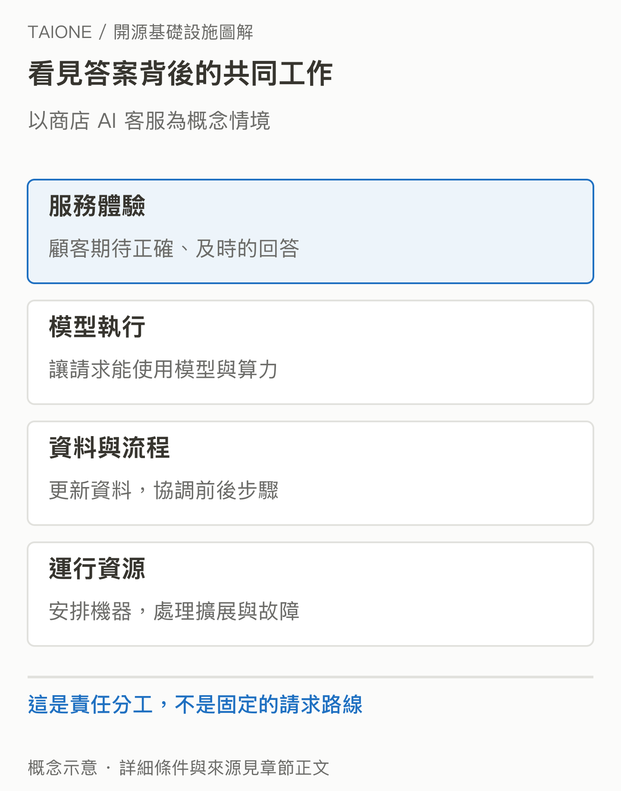

# 01｜一個 AI 服務，為什麼需要這麼多基礎設施？

<!-- BOOK-NAV-START -->

第一篇 · 建立全景 · 第 **01 / 18** 章

| [**← 閱讀入口**](../README.md) | [**回總目錄**](../README.md#閱讀目錄) | [**第 02 章 →**](02-open-source-governance.md) |
| :--- | :---: | ---: |

<!-- BOOK-NAV-END -->
**模型負責產生結果，基礎設施讓資料、算力與工作流程能可靠地供應這個結果。**

## 從一個看得見的問題開始

想像一家商店做了 AI 客服。展示時，一個人問退貨規則，回答很順；正式上線後，數百位顧客同時提問，商品資料每天改動，偶爾還有機器故障。模型仍然是同一個，服務卻可能變慢、變貴，或拿到過期資料。

這時需要處理的，已不只是「模型夠不夠聰明」。資料何時更新、請求如何排隊、工作放到哪台機器，以及某一步失敗後如何恢復，都會影響顧客最後看到的答案。這些反覆出現在不同產品裡的工程問題，就是理解 AI 基礎設施的入口。

同一個服務背後有多種責任；實際產品會依需求選擇元件。概念示意。[SVG 原圖](../assets/figures/01-a.svg)

## 把不同的困難分開處理

推論引擎處理「模型如何執行及服務請求」；例如 vLLM 提供模型推論與服務能力，包含請求批次與記憶體管理等機制。[vLLM 官方介紹](https://docs.vllm.ai/en/latest/)

資料引擎處理「如何讀取、篩選與計算大量資料」。DataFusion 可以被嵌入其他資料系統，讓產品開發者沿用查詢能力，集中處理自己的特殊需求。[DataFusion 官方介紹](https://datafusion.apache.org/user-guide/introduction.html)

運行平台則關心「程式如何持續活著」。Kubernetes 提供部署、擴展與故障後替換等能力。它不會自動替模型判斷回答真假，也不包辦資料庫或所有監控工具。[Kubernetes 功能與邊界](https://kubernetes.io/docs/concepts/overview/)

## 為什麼底層改動能影響很多產品？

假設某個共用元件修正了記憶體使用問題，採用新版且符合條件的產品，都可能受益。相反地，介面改動或錯誤也可能讓下游需要調整。影響力來自「有多少工作依賴這個能力，以及改動能否被實際採用」，不能只看專案名稱響不響亮。

這也解釋維護者為何要在速度、穩定性與相容性之間取捨。新功能做出來只是起點，還得考慮測試、升級、故障處理，以及不同使用者的需求。規模越大，共同元件的品質越容易被放大。

## 帶著問題讀這本書

後面的 Track 將從模型服務、算力管理、資料處理與流程協作逐一切入。讀者不必先記住所有名詞；先問「少了這類能力，產品會卡在哪裡？」再問「誰願意投入資源改善它？」便能把技術與產業連起來。

**證據限制：**商店情境與影響機制是本書的教學示例，不是採用案例或效能測量。這些元件的功能可以互補，但不表示每個 AI 服務都必須使用它們，或一定需要這麼複雜的架構。

<!-- BOOK-NAV-START -->

---

接著讀：**02｜程式碼公開以後，究竟是誰在管？**。

| [**← 閱讀入口**](../README.md) | [**回總目錄**](../README.md#閱讀目錄) | [**第 02 章 →**](02-open-source-governance.md) |
| :--- | :---: | ---: |

<!-- BOOK-NAV-END -->
