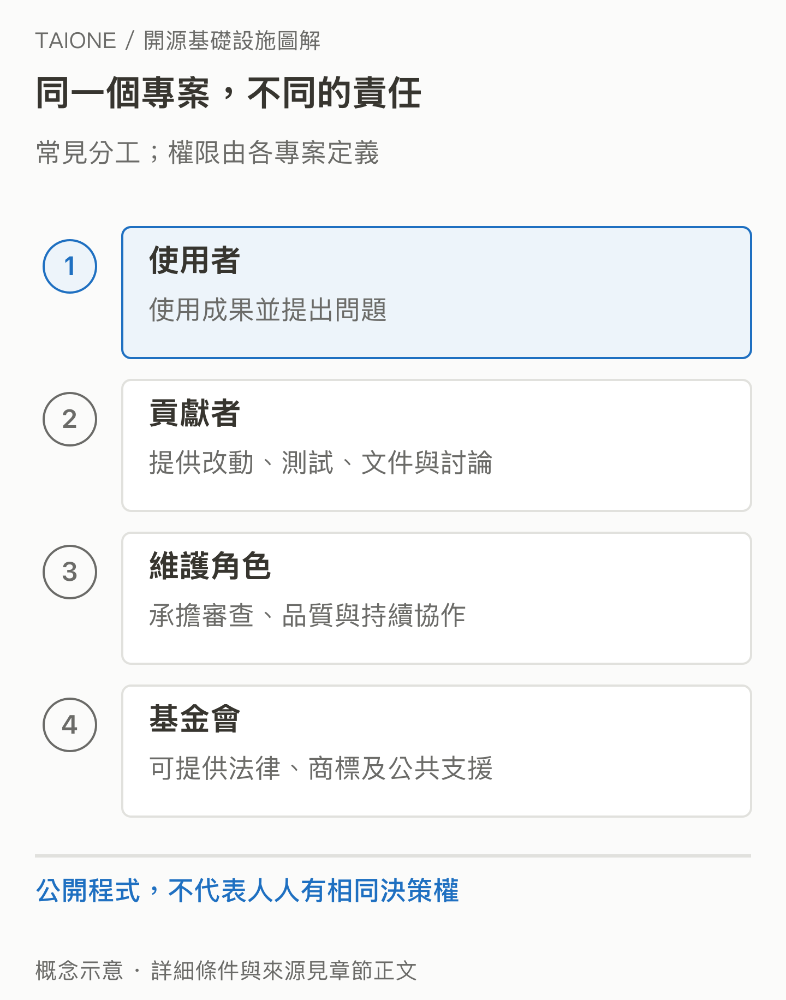
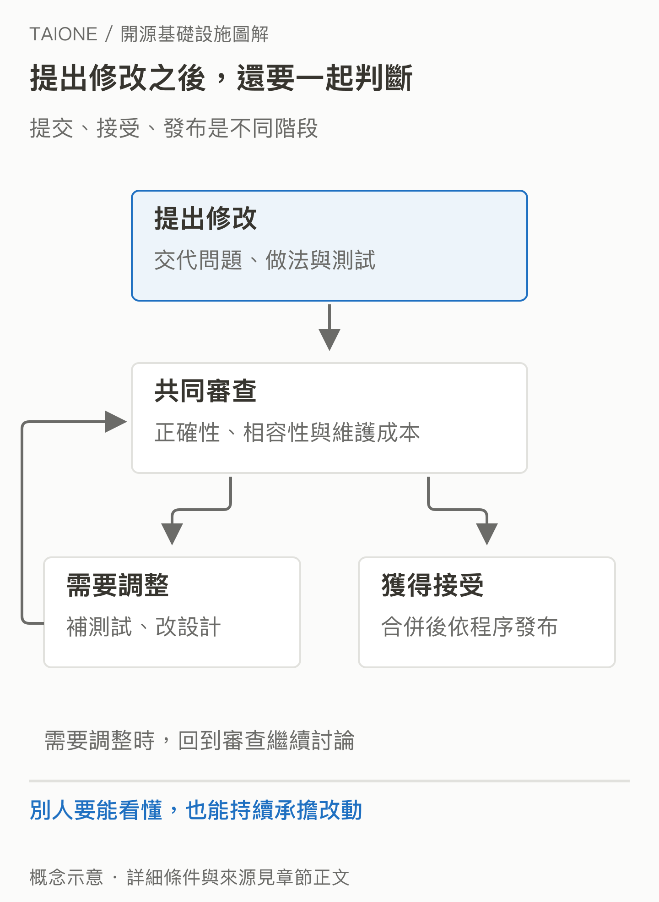

# 02｜程式碼公開以後，究竟是誰在管？

<!-- BOOK-NAV-START -->

第一篇 · 建立全景 · 第 **02 / 18** 章

| [**← 第 01 章**](01-ai-service.md) | [**回總目錄**](../README.md#閱讀目錄) | [**第 03 章 →**](03-why-companies-invest.md) |
| :--- | :---: | ---: |

<!-- BOOK-NAV-END -->
**開源授權讓人能依條件使用與修改程式；專案治理則決定大家如何協作、接受修改及承擔責任。**

## 能拿來改，不代表能改官方版本

某位工程師下載一個開源專案，修好了自己遇到的問題。她可以依授權條款使用修改版，也可以把改動送回原專案；但原專案是否接受，仍要走它的審查程序。開源定義關心原始碼、修改與散布等權利，不會自動賦予每位使用者相同的專案決策權。[OSI 開源定義](https://opensource.org/osd)

因此，理解開源要同時看兩份規則：授權說明「可以怎樣使用成果」，治理說明「共同成果由誰、用什麼程序維護」。原始碼看得見，只回答了其中一部分。

先記住幾個之後會一直出現的詞：**上游（upstream）**是大家共同維護的原專案；**PR** 是把修改送交審查的提案；**Review** 是審查；**RFC** 通常是徵求討論的設計提案。**Committer** 通常指依專案規則獲得提交或合併權限的人，**Maintainer** 則強調持續維護的責任；兩者的實際權限仍以各專案規則為準。

這是常見的責任分工示意，不是所有開源專案共用的組織圖。[SVG 原圖](../assets/figures/02-a.svg)

## 基金會、企業與維護者各做什麼？

Apache 軟體基金會提供法律、商標與共同基礎設施等支援；各專案的 PMC（專案管理委員會）負責專案治理與技術方向。成員可能受雇於企業，但在 Apache 擔任角色的是個人，企業不是藉由付薪便取得一個席位。[ASF 運作方式](https://www.apache.org/foundation/how-it-works/)

別把這套安排套到所有專案。vLLM 有自己的 Core Maintainers、Lead Maintainers 與 Committers，並明確說明個人貢獻與維護責任的重要性。相同的「維護者」稱呼，在不同社群可能有不同權限。[vLLM 治理規則](https://docs.vllm.ai/en/latest/governance/process/)

## 一個修正怎麼變成共同成果？

貢獻者先交代問題、提出改動與測試；審查者確認是否正確、是否破壞別人、未來能否維護。有時需要補證據或調整設計，最終才依權限合併，並透過發布程序提供給使用者。審查慢不一定代表不歡迎新人，也可能是變更牽動了其他情境。

提交、接受與發布是不同階段；實際程序以各專案規則為準。[SVG 原圖](../assets/figures/02-b.svg)

## 維護是一種持續的責任

寫功能之外，回答問題、整理文件、檢查回歸錯誤、協助新人與準備版本都需要時間。Apache 的貢獻指南也明確把文件、設計與社群工作納入貢獻。[Apache 貢獻指南](https://community.apache.org/contributors/)

對想參與國際社群的人而言，能力包含把理由說清楚、接受審查，以及照顧自己改動之外的需求。這些協作習慣讓陌生人能一起維護同一份程式，也讓信任逐漸累積。

**證據限制：**本章用 Apache 與 vLLM 示範治理差異，不是完整分類。授權、基金會、企業來源與現行決策權必須分別查證；任何角色都不能只靠職稱或公司標誌推定。

<!-- BOOK-NAV-START -->

---

接著讀：**03｜人人都能用，企業為什麼還要付錢維護？**。

| [**← 第 01 章**](01-ai-service.md) | [**回總目錄**](../README.md#閱讀目錄) | [**第 03 章 →**](03-why-companies-invest.md) |
| :--- | :---: | ---: |

<!-- BOOK-NAV-END -->
