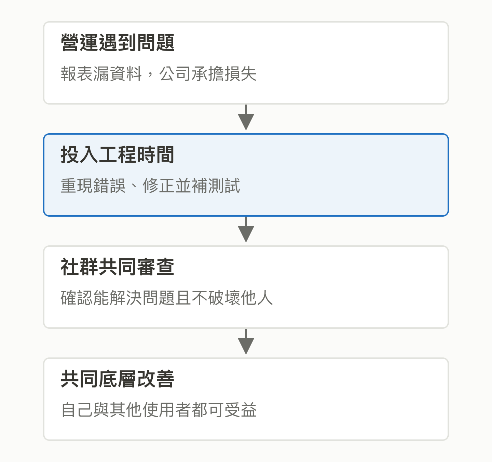
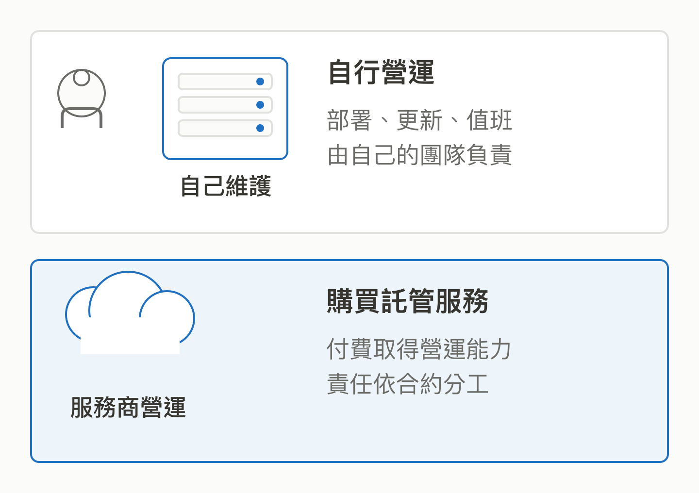

# 03｜人人都能用，企業為什麼還要付錢維護？

<!-- BOOK-NAV-START -->

第一篇 · 建立全景 · 第 **03 / 18** 章

| [**← 第 02 章**](02-open-source-governance.md) | [**回總目錄**](../README.md#閱讀目錄) | [**第 04 章 →**](04-taione-intent.md) |
| :--- | :---: | ---: |

<!-- BOOK-NAV-END -->
**企業投入開源，常是在改善自己依賴的共同底層，並在產品、服務與專業能力上取得回報。**

## 先算一筆自己的帳

假設一家電商每晚都靠某個開源工具整理訂單。工具有個錯誤，讓報表偶爾漏資料。公司可以等待別人修，也可以請工程師研究、測試，再把修正送回原專案。第二種做法雖然花薪水，卻可能減少事故與內部維護負擔；其他公司同時受益，也不會消除自己的收益。

這是機制示例。真實案例是 AWS 在 2020 年說明：因服務依賴 Rust，會聘用 Rust、Tokio 貢獻者，讓他們有時間改善這些技術，也建立公司內部的專業能力。這證明一種投資理由，不代表每家公司都有相同動機。[AWS 的原文](https://aws.amazon.com/blogs/opensource/why-aws-loves-rust-and-how-wed-like-to-help/)

*圖 03-1｜修共同底層，也在改善自己的服務。修正進入上游後，受益者可以很多；投入者仍能改善自己的營運。概念示意。* [SVG 原圖](../assets/figures/03-a.svg)

## 程式公開，不代表營運沒有價值

拿得到程式碼，仍要有人部署、更新、監控、處理故障。公司可以自行培養團隊，也可以付費購買託管服務。Confluent 的官方文件便把免於自行安裝、升級與修補 Kafka，以及額外的監控、安全和資料治理能力，列為雲端服務內容。商業產品與 Apache Kafka 的範圍、實作不能直接畫上等號。[Confluent Cloud 說明](https://docs.confluent.io/cloud/current/get-started/confluent-cloud-basics.html)

因此，共用底層與商業競爭可以同時存在。不同供應商可以改善共同元件，又在部署體驗、整合、支援與服務品質上競爭；但並非所有商業擴充都會回到開源專案。

*圖 03-2｜程式可取得，營運仍需要人。可自由取得的程式與付費服務可以並存；客戶付費購買的內容要逐項看清楚。* [SVG 原圖](../assets/figures/03-b.svg)

## 付薪水，也不等於買到決定權

企業希望自己的需求被理解，最直接的方式是提出問題、設計與測試，持續參與討論。是否接受修改，仍要依專案規則決定。Apache 的獨立性原則要求參與者以個人身分貢獻，公司的雇用關係或贊助本身不構成專案控制權。[Apache 專案獨立性](https://community.apache.org/projectIndependence.html)

維護者因此要平衡眼前需求與長期成本：某公司的捷徑會不會破壞其他使用者？新增功能誰來測、誰來修？真正能持續參與這些取捨，往往比只會安裝工具更有價值。

## 對台灣意味著什麼？

本書的分析是：如果企業的產品依賴某項開源技術，培養能理解與修正上游的人，可能讓企業更早處理限制、提出需求，也降低完全等待外部供應商的程度。回報不保證是直接販售程式碼，更可能是可靠性、能力與合作機會。

**證據限制：**企業文章是其自身說明，不能推成全部公司的動機或投資報酬。採用、雇用貢獻者、基金會贊助與治理權是四件不同的事；開源授權也不等於無條件使用。[開源定義與授權原則](https://opensource.org/osd)

<!-- BOOK-NAV-START -->

---

接著讀：**04｜TAIONE 希望台灣的角色發生什麼改變？**。

| [**← 第 02 章**](02-open-source-governance.md) | [**回總目錄**](../README.md#閱讀目錄) | [**第 04 章 →**](04-taione-intent.md) |
| :--- | :---: | ---: |

<!-- BOOK-NAV-END -->
