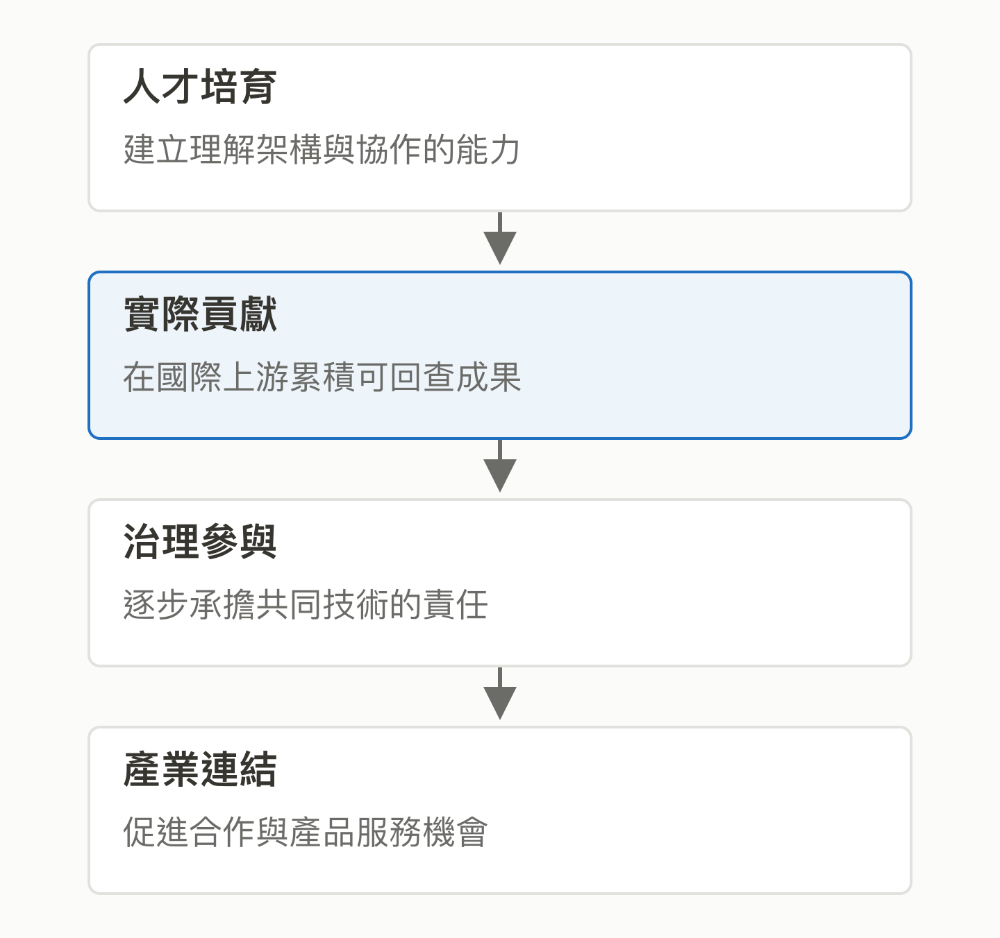

# 04｜TAIONE 希望台灣的角色發生什麼改變？

<!-- BOOK-NAV-START -->

第一篇 · 建立全景 · 第 **04 / 18** 章

| [**← 第 03 章**](03-why-companies-invest.md) | [**回總目錄**](../README.md#閱讀目錄) | [**第 05 章 →**](05-track-landscape.md) |
| :--- | :---: | ---: |

<!-- BOOK-NAV-END -->
**官方目標是讓台灣從開源使用者走向核心貢獻者與治理參與者，並把這些能力連結到產業。**

## 人才培育是起點，目標延伸到治理

如果一家公司只會安裝工具，遇到限制時，通常只能等待、繞過或另找替代方案。如果團隊有人能理解上游設計、提出修正並參與討論，就多了一條直接改善共同技術的路。這是本書用來理解計畫的情境，不是已發生的計畫成果。

TAIONE 的基金會簡介則給出直接證據：它希望培養能貢獻國際專案、逐步取得 Committer 等角色的人才，也把技術自主、產業競爭力與參與開源治理列入設立脈絡。這些目標超過短期課程結業或履歷加分。[基金會簡介](https://taione.org/about/intro)

TAIONE 在這裡提供培育與連結；它與 Apache 是不同的基金會，也不因開設 Track 就取得上游專案的管理權。以 Apache 為例，專案仍由自己的 PMC 依規則治理。[Apache 的治理邊界](https://community.apache.org/projectIndependence.html)

*圖 04-1｜從會使用，到能共同決定。圖中是官方目標的整理；每一步仍需要可查證的投入與成果。* [SVG 原圖](../assets/figures/04-a.svg)

## 為什麼安排維護者帶領？

Fellowship 官方介紹強調由具維護與核心貢獻經驗的 Track Lead 帶領，透過程式碼審查、架構討論與交流時間，讓參與者直接接觸國際專案的工作方式；成果也包含 PR、Review 與 RFC 紀錄。[Fellowship 計畫介紹](https://taione.org/fellowship/about)

本書的分析是，這類安排針對的是「進入真實協作」的門檻：新人不只缺技術名詞，還不知道什麼問題值得做、如何提出可審查的改動，以及如何理解被要求修改的原因。嚮導若能把這些隱含知識講清楚，就可能縮短摸索時間。

## 為什麼又談硬體、資服與市場？

TAIONE 的業務說明將核心貢獻者培育與硬體、資服產業連結，並提到國際合作及市場機會。[計畫與業務](https://taione.org/programs)

可以這樣理解其中的可能機制：產業帶來真實的效能、相容性與營運問題；有上游經驗的人能把它們轉成可共同解決的技術需求。當改進被採用，企業可能獲得更合適的基礎能力，社群也得到有用的案例與維護投入。這是對策略的解讀，不能當作已有商業成效。

## 什麼才算朝目標前進？

若要評估這個意圖是否落實，本書建議看持續參與、可回查的技術討論、被接受且有人維護的改進，以及人才是否能協助其他人參與。只計算報名人數、課程時數或提交次數，尚不足以回答影響力是否形成。

**證據限制：**官方已公開整體目的，但本文未找到逐一遴選這 11 個 Track 的完整決策紀錄。上述評估方式是作者建議，並非官方 KPI；加入計畫或取得 Fellow 資格，也不等於上游專案授予正式治理角色。

<!-- BOOK-NAV-START -->

---

接著讀：**05｜這 11 個 Track 在同一張地圖的哪裡？**。

| [**← 第 03 章**](03-why-companies-invest.md) | [**回總目錄**](../README.md#閱讀目錄) | [**第 05 章 →**](05-track-landscape.md) |
| :--- | :---: | ---: |

<!-- BOOK-NAV-END -->
