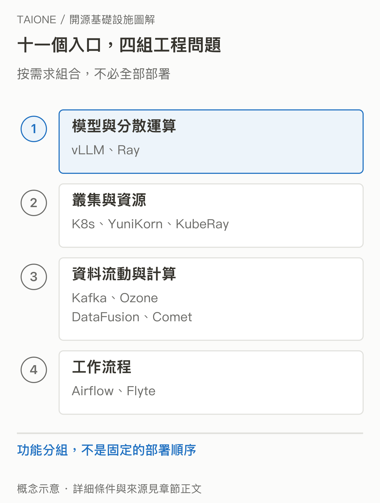

# 05｜這 11 個 Track 在同一張地圖的哪裡？

<!-- BOOK-NAV-START -->

第一篇 · 建立全景 · 第 **05 / 18** 章

| [**← 第 04 章**](04-taione-intent.md) | [**回總目錄**](../README.md#閱讀目錄) | [**第 06 章 →**](06-vllm.md) |
| :--- | :---: | ---: |

<!-- BOOK-NAV-END -->
**它們分別切入模型服務、算力管理、資料處理與流程協作，組成一張問題地圖，而非唯一的技術配方。**

## 先用四種問題定位

TAIONE 官方將 11 個 Track 分成四類。本書保留這個分工，再從初學者容易感受到的問題安排閱讀：服務如何跑得動、算力如何交付、資料如何可用，以及每天的工作如何可靠完成。[官方 Track 清單](https://taione.org/fellowship/tracks)

vLLM 與 Ray 位於第一組，分別讓讀者認識模型推論服務，以及把工作擴展到多台機器的問題。Kubernetes、Apache YuniKorn 與 KubeRay 位於第二組，從程式的運行與資源安排，讀到特定運算系統如何部署在共同平台上。

Apache Kafka、Apache Ozone、Apache DataFusion 與 Apache DataFusion Comet 位於第三組，關心資料的流動、保存、查詢與加速。Apache Airflow 與 Flyte 則帶出第四組：當工作有許多步驟、需要重跑或由多人合作時，如何管理整體執行。

同一專案可能跨越多個用途；位置是閱讀入口，不是互斥的產品分類。[SVG 原圖](../assets/figures/05-a.svg)

## 有些是夥伴，有些解決相近問題

Ray 與 KubeRay 不是兩個同名競品。KubeRay 是 Ray 整體專案旗下的 Kubernetes 支援工具，處理 Ray 叢集在 Kubernetes 上的生命週期。[Ray on Kubernetes](https://docs.ray.io/en/latest/cluster/kubernetes/index.html)

DataFusion 與 Comet 也有不同責任：前者提供可被其他系統使用的查詢引擎，後者把這類原生執行能力接到 Spark，並對不支援的功能保留回退機制。[Comet 官方說明](https://datafusion.apache.org/comet/)

這些關係很重要。若把每個名字都當成「獨立、完整的 AI 平台」，就會誤讀清單；一個專案也可能因為很好地連接其他系統而有價值。

## 為什麼清單裡有這麼多 Apache？

依官方名稱計算，11 個 Track 中有 6 個帶著 Apache：YuniKorn、Kafka、Ozone、DataFusion、Comet 與 Airflow。這份清單包含許多資料與分散式系統，也就會碰到多個由 Apache 社群治理的專案；其中 DataFusion 與 Comet 又有上下游關係，不能把 Track 數量直接當成互不相關的組織數量。

這能解釋你看見的組合，卻不能證明主辦方是「因為 Apache 品牌才選它們」。比較合理的閱讀方式，是逐一看它們解決什麼問題，以及是否有合適的人帶領貢獻。TAIONE 和 Apache 的不同角色，已在 [第 04 章](04-taione-intent.md) 說明；完整選題權重仍有待官方補充。

## 為什麼不畫成一條完整流水線？

一家小團隊可能只需要託管模型服務與簡單資料庫；另一家公司已有 Spark，關注的只是既有查詢能否更快。兩者都能理解這張地圖，卻不必安裝同一組工具。實際選擇還要看資料量、工作型態、人才與既有系統。

## 接下來怎麼讀？

每章先看具體障礙，再看專案如何處理，最後才問它為何值得維護。比較影響力時，應看下游依賴、實際採用、互通能力與治理責任等不同面向，而不是把功能多寡直接換成排名。第 17 章會再把這些線索合起來，討論選題意圖能推到哪裡。

**證據限制：**分組與名單來自官方；閱讀順序與跨組解讀是作者安排。清單不是全球 AI 基礎設施的完整全集，也不代表這 11 個方向具有相同採用規模、成熟度或領導地位。

<!-- BOOK-NAV-START -->

---

接著讀：**06｜vLLM：模型已經會回答，為什麼還需要推論引擎？**。

| [**← 第 04 章**](04-taione-intent.md) | [**回總目錄**](../README.md#閱讀目錄) | [**第 06 章 →**](06-vllm.md) |
| :--- | :---: | ---: |

<!-- BOOK-NAV-END -->
