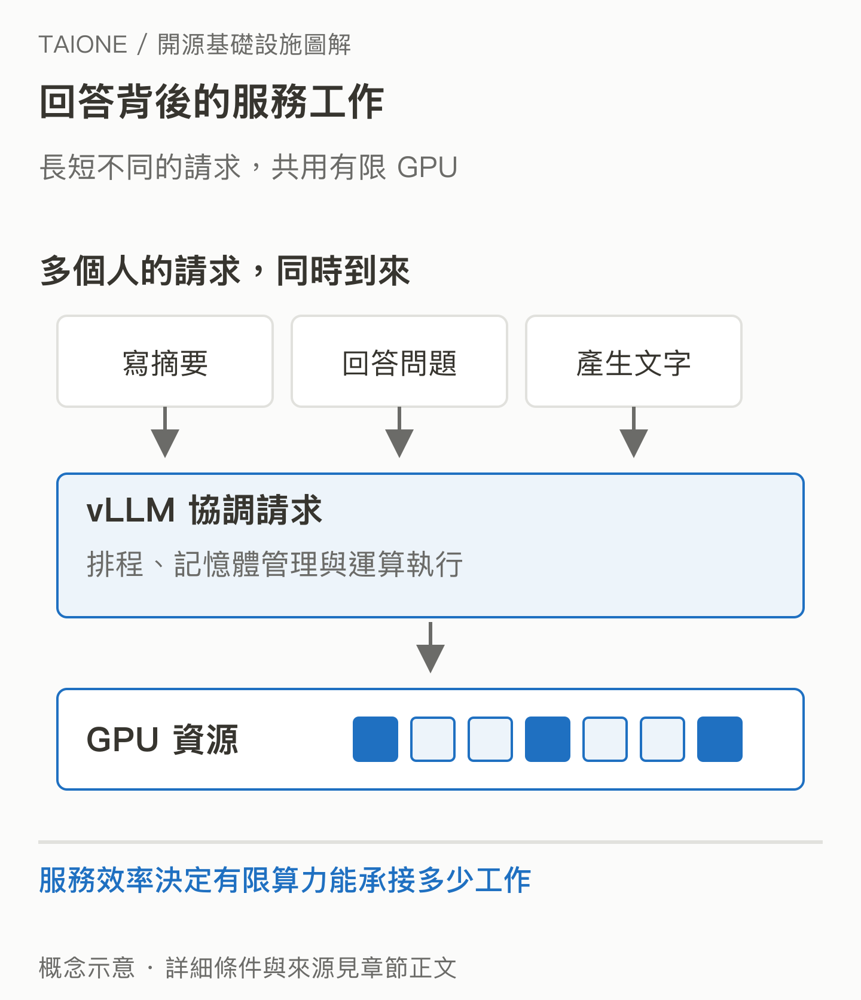
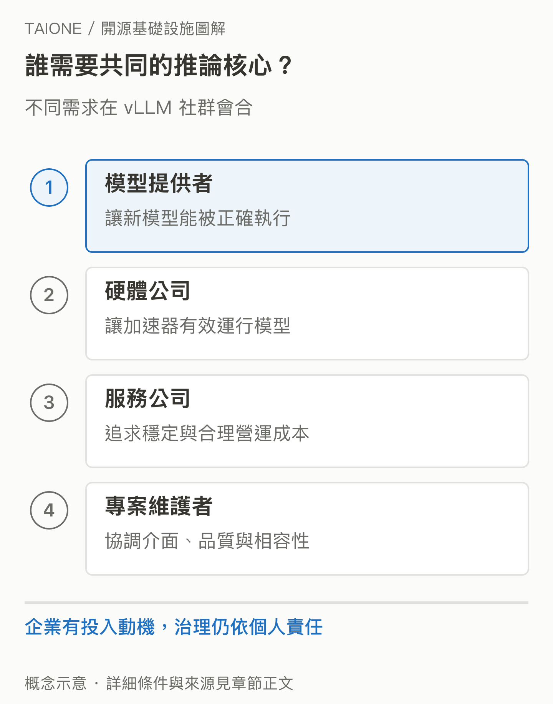

# 06｜vLLM：模型已經會回答，為什麼還需要推論引擎？

<!-- BOOK-NAV-START -->

第二篇 · 模型與分散運算 · 第 **06 / 18** 章

| [**← 第 05 章**](05-track-landscape.md) | [**回總目錄**](../README.md#閱讀目錄) | [**第 07 章 →**](07-ray.md) |
| :--- | :---: | ---: |

<!-- BOOK-NAV-END -->
**vLLM 讓已訓練好的模型有效率地提供回答，處理的是「如何用有限算力，持續服務更多請求」。**

## 一個人能用，很多人同時用呢？

想像一間公司把模型下載到 GPU，做出能回答問題的客服。展示時只有一人使用，正式上線後卻同時收到長短不同的問題：有人只問營業時間，有人貼進整份合約。GPU 除了放模型，還得保存各段對話生成過程中的中間資料；安排得不好，就會浪費記憶體、排隊太久。

vLLM 的位置在模型與應用服務之間。它起源於 UC Berkeley 的研究工作，提供模型推論與服務能力；它並不負責把客服的業務知識教給模型。[官方介紹](https://docs.vllm.ai/en/latest/)

*同一個模型，服務方式會改變能承接的工作量。這是概念示意，沒有表示固定加速倍數。* [SVG 原圖](../assets/figures/06-a.svg)

## 關鍵是把昂貴資源用好

你可以把生成中的中間資料想成每位客人的工作筆記。PagedAttention 把這些資料分塊配置，減少預留大塊連續空間造成的浪費；continuous batching 則讓新的請求能加入正在運行的批次，不必等整批都結束。這些改進影響吞吐量，也就是一定時間內能完成多少工作。[專案最初的技術說明](https://vllm.ai/blog/2023-06-20-vllm)

因此，推論引擎的改進可以被多個模型、硬體與下游服務重用。這是它的影響力來源之一：一次底層改進，可能改善許多人的成本與體驗。

## 公司投入，換到什麼？

Red Hat 說明它參與 vLLM 貢獻，並把它整合進有企業支援的推論產品。公司可以靠整合、驗證與服務收費，同時改善自己依賴的共同核心。[Red Hat 的產品與投入說明](https://www.redhat.com/en/blog/accelerate-ai-inference-vllm)

*各方帶來需求與工程投入；有商業利益不等於擁有專案決策權。* [SVG 原圖](../assets/figures/06-b.svg)

vLLM 的治理文件明確區分個人與公司：Committer 身分屬於個人；維護者負責審查、相容性與技術方向，不能靠公司付費取得資格。[治理規則](https://docs.vllm.ai/en/latest/governance/process/)

## 為什麼值得培養維護者？

維護工作包括接入新模型、處理不同硬體、修正效能退化，以及確認最佳化沒有破壞答案計算。對台灣而言，能把硬體或產業場景的問題整理成上游接受的設計與測試，可能增加參與軟體生態的能力；這是本書的分析，並非已證明的計畫成效。

**證據界線：**企業整合可證明實際商業連結；不能據此推算全球市占率。速度仍取決於模型、硬體、請求長度及版本，早期 benchmark 不能直接套用今天的服務。

補充：推論與訓練的差別

訓練會調整模型參數；推論則使用模型參數處理新輸入。vLLM 主要關注後者。KV cache 是生成過程保留的中間計算，不等於企業知識庫，也不等於長期記憶。

<!-- BOOK-NAV-START -->

---

接著讀：**07｜Ray：一台電腦不夠時，程式如何交給很多台一起做？**。

| [**← 第 05 章**](05-track-landscape.md) | [**回總目錄**](../README.md#閱讀目錄) | [**第 07 章 →**](07-ray.md) |
| :--- | :---: | ---: |

<!-- BOOK-NAV-END -->
