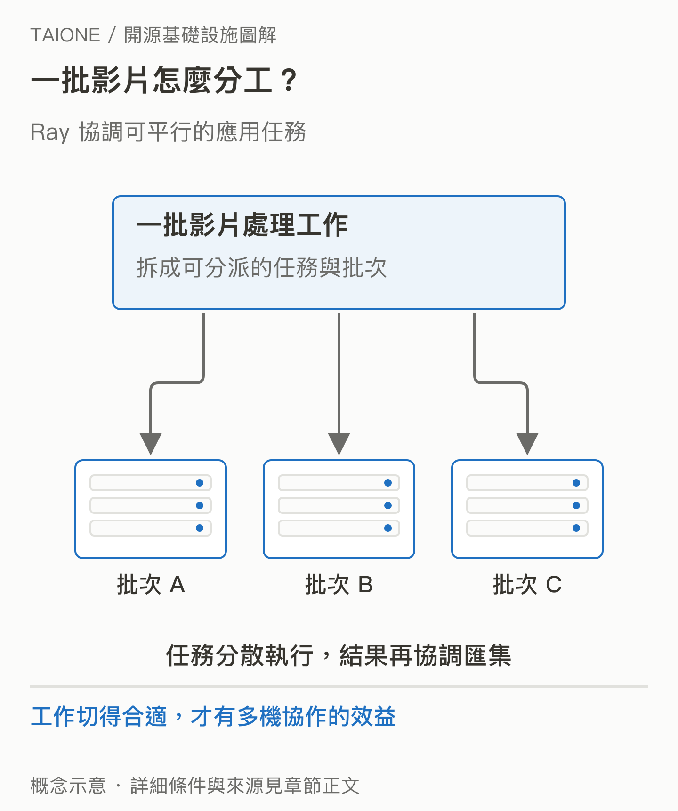
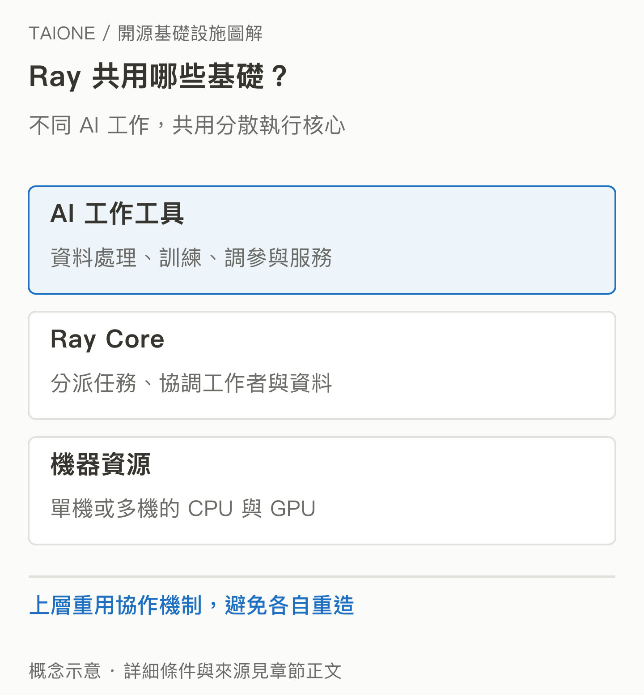

# 07｜Ray：一台電腦不夠時，程式如何交給很多台一起做？

<!-- BOOK-NAV-START -->

第二篇 · 模型與分散運算 · 第 **07 / 18** 章

| [**← 第 06 章**](06-vllm.md) | [**回總目錄**](../README.md#閱讀目錄) | [**第 08 章 →**](08-kubernetes.md) |
| :--- | :---: | ---: |

<!-- BOOK-NAV-END -->
**Ray 提供分散式執行能力，讓開發者把 AI 與 Python 工作拆成可協作的任務，交給多台機器運行。**

## 當資料量超過筆電能處理的範圍

假設你要替一批影片產生摘要。讀取影片需要 CPU，模型辨識需要 GPU，最後還得整理結果。一台電腦能完成少量示範，但數量增加後，問題變成：工作分給誰？結果怎麼傳？哪一項完成後才能接下一項？

Ray 提供 Tasks、Actors 與 Objects 等抽象：可分派的函式工作、保留狀態的工作者，以及在工作間傳遞的資料。開發者仍須設計任務邊界，Ray 幫忙處理分散執行的機制。[Ray 核心概念](https://docs.ray.io/en/latest/ray-core/key-concepts.html)

*先辨認可以分工的部分，才可能有效利用多台機器。* [SVG 原圖](../assets/figures/07-a.svg)

## 為什麼不只是「多開幾個程式」？

單機平行只需要管理同一台電腦；跨機器還會遇到網路、資料搬移、機器故障與資源不足。Ray 把共同機制放進執行核心，再提供 Data、Train、Tune、Serve 等工具，分別支援資料處理、分散式訓練、實驗調參與模型服務。[官方專案概覽](https://github.com/ray-project/ray)

*共用執行基礎之上，可以長出不同 AI 工作方式；不是每個專案都要用完所有工具。* [SVG 原圖](../assets/figures/07-b.svg)

它的重要性在於讓團隊重用一套分散運算基礎，降低每次擴大工作量都重寫控制系統的負擔。但資料搬移與協調也有成本，工作很小或無法拆分時，多機不一定更快。

## 開源 Ray 與 Anyscale 是什麼關係？

Anyscale 由 Ray 的創建者創辦，提供以 Ray 為基礎的商業平台。這展示了「共同引擎公開，營運平台與支援形成產品」的路線。公司身分、付費平台與開源程式本身仍須分開看。[Anyscale 自述](https://www.anyscale.com/about)

Ray 的治理文件將角色分為貢獻者、Committer、技術指導委員會與 lead maintainers，並列明其 LF Projects 架構。重要變更透過治理程序討論；使用 Anyscale 並不是貢獻 Ray 的前提。[Ray 治理](https://docs.ray.io/en/latest/ray-governance/index.html)

## 維護者改變的是什麼？

維護者要讓不同機器、工作者與資料能可靠協作，並處理測試、故障、效能與介面相容性。這些看不見的修正可能被很多種 AI 應用共用。對台灣的可能價值，是建立能診斷跨機器瓶頸、提出共同解法的工程人才，而不只熟悉某一個雲端操作介面。

**證據界線：**官方功能與企業產品可支持上述技術和商業關係；本章未以市場占有率證明 Ray 是唯一標準，也未把所有 Ray 程式都視為能直接無痛擴展。

補充：Ray 與 Kubernetes 為什麼可以一起出現？

Ray 關注應用裡的分散任務；Kubernetes 關注容器化服務如何被部署和管理。兩者可以搭配，接合的工作會在[第 10 章 KubeRay](10-kuberay.md)說明。

<!-- BOOK-NAV-START -->

---

接著讀：**08｜Kubernetes：服務一直要在線，誰負責把它維持住？**。

| [**← 第 06 章**](06-vllm.md) | [**回總目錄**](../README.md#閱讀目錄) | [**第 08 章 →**](08-kubernetes.md) |
| :--- | :---: | ---: |

<!-- BOOK-NAV-END -->
