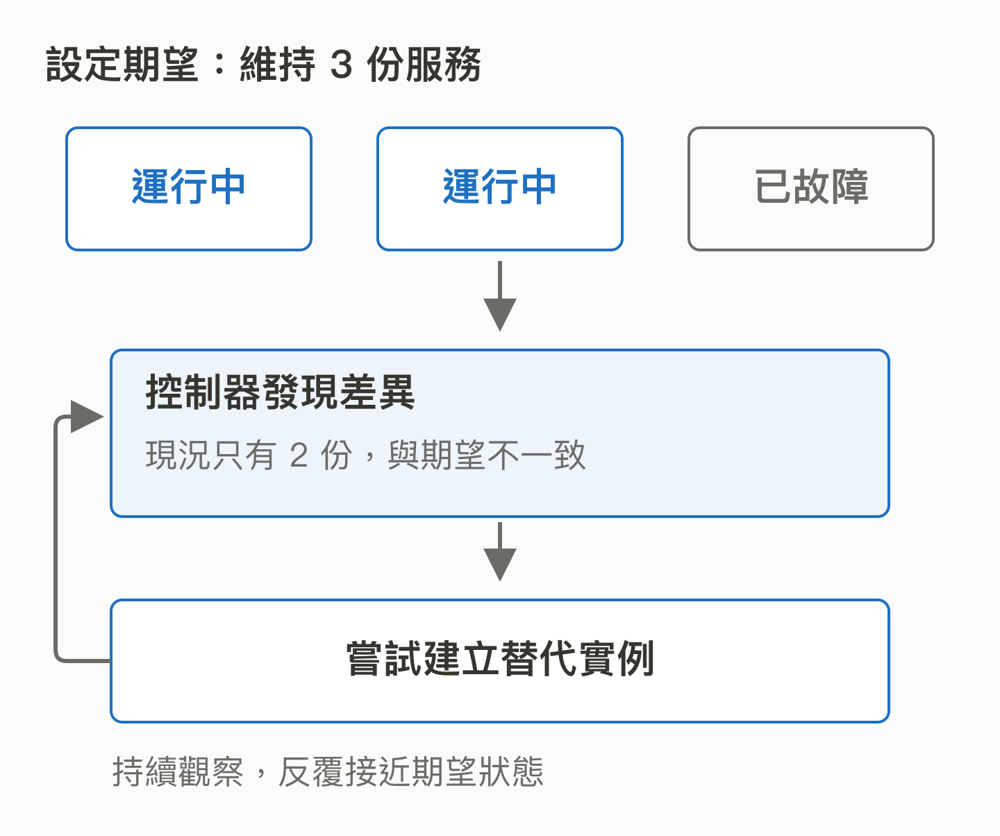
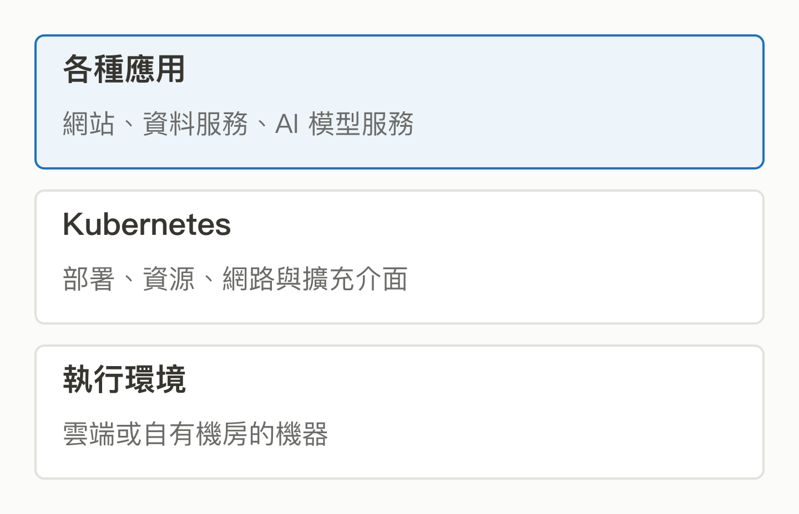

# 08｜Kubernetes：服務一直要在線，誰負責把它維持住？

<!-- BOOK-NAV-START -->

第三篇 · 算力與系統管理 · 第 **08 / 18** 章

| [**← 第 07 章**](07-ray.md) | [**回總目錄**](../README.md#閱讀目錄) | [**第 09 章 →**](09-yunikorn.md) |
| :--- | :---: | ---: |

<!-- BOOK-NAV-END -->
**Kubernetes 讓團隊描述容器化服務應有的狀態，再由系統持續協調機器與程式，接近期望的部署結果。**

## 三個服務實例，壞掉一個怎麼辦？

想像 AI 客服有三份相同的服務同時接客。半夜一台機器故障，如果全靠工程師登入重啟，規模愈大就愈難照顧。Kubernetes 讓團隊宣告需要幾份服務、多少資源，再由控制機制觀察現況、建立或替換執行中的單位。[官方概覽](https://kubernetes.io/docs/concepts/overview/)

*圖 08-1｜少一份服務時怎麼辦？「三份」只是教學情境；恢復需要足夠資源、正確設定與可用的底層系統。* [SVG 原圖](../assets/figures/08-a.svg)

這種持續校正也用於更新版本：例如逐步換掉舊版服務，觀察新版是否就緒。Deployment 就是其中一種管理方式。它不會修好程式邏輯錯誤，也不保證故障時每個請求都成功。[Deployment 文件](https://kubernetes.io/docs/concepts/workloads/controllers/deployment/)

## 它為什麼影響 AI 以外的世界？

網站、資料服務與 AI 模型都可能被包裝成容器。容器可以粗略理解為把程式與執行依賴一起打包。當不同服務共用部署與管理方式，平台團隊就能建立共通的資源、網路與維運介面；其他專案也能沿著介面擴充。

*圖 08-2｜多種服務的共同管理介面。共同管理介面讓多種產品接合；各服務的資料與應用邏輯仍由自己的系統負責。* [SVG 原圖](../assets/figures/08-b.svg)

這使 Kubernetes 成為平台生態的連接位置。可攜性表示有共同基礎，仍不代表不同雲端的儲存、網路與權限設定完全相同。

## Google 起源，等於 Google 決定一切嗎？

專案在 Google 起源，2015 年宣布捐贈給 CNCF；早期開發也有 Red Hat 等公司參與。[官方十年回顧](https://kubernetes.io/blog/2024/06/06/10-years-of-kubernetes/)

今天的工作主要分布在 SIG，也就是針對網路、排程、儲存等主題的協作群組。治理文件說明跨組織成員、子專案責任及公開決策機制。公司的工程投入能影響技術討論，仍須依社群職責與程序做決定。[治理文件](https://github.com/kubernetes/community/blob/main/governance.md)

Google 的 GKE 是商業管理服務，並提供 KubeRay 整合，顯示公司能在開源共同基礎上提供營運價值。[Google Cloud 整合案例](https://cloud.google.com/blog/products/containers-kubernetes/use-ray-on-kubernetes-with-kuberay)

## 培養維護者的槓桿在哪裡？

影響共用介面、資源分配或故障處理的改進，可能使多種上層產品受益。台灣人才若能長期參與特定 SIG，就有機會把真實機房與 AI 工作需求帶入設計；這是能力路徑的分析，並不保證特定提案會被接受。

**證據界線：**本章用治理與整合案例說明其生態位置，沒有用「大家都在用」取代採用證據。團隊也應承擔平台複雜度，不是所有小型服務都需要 Kubernetes。

<!-- BOOK-NAV-START -->

---

接著讀：**09｜Apache YuniKorn：大家都要算力時，誰先用、怎麼分？**。

| [**← 第 07 章**](07-ray.md) | [**回總目錄**](../README.md#閱讀目錄) | [**第 09 章 →**](09-yunikorn.md) |
| :--- | :---: | ---: |

<!-- BOOK-NAV-END -->
