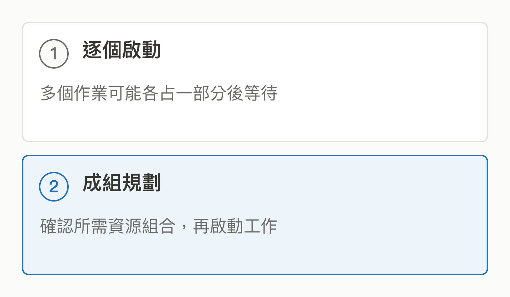

# 09｜Apache YuniKorn：大家都要算力時，誰先用、怎麼分？

<!-- BOOK-NAV-START -->

第三篇 · 算力與系統管理 · 第 **09 / 18** 章

| [**← 第 08 章**](08-kubernetes.md) | [**回總目錄**](../README.md#閱讀目錄) | [**第 10 章 →**](10-kuberay.md) |
| :--- | :---: | ---: |

<!-- BOOK-NAV-END -->
**YuniKorn 是資源排程器，幫助多個團隊在 Kubernetes 上依配額、公平性與工作需求共享有限算力。**

## 買到機器之後，還有分配問題

想像同一間公司的搜尋團隊要跑資料更新，研究團隊要訓練模型，分析團隊又要做大批報表。大家共用機器，如果先到者把資源拿光，其他工作可能長期等待；如果每組各留一批專用機器，又可能一邊閒置、一邊不夠用。

YuniKorn 在這裡處理「資源該分給誰、工作該放在哪」。它可作為 Kubernetes 預設排程器的替代選項，提供有層級的資源佇列、工作排序、公平分享及搶占等能力。[官方介紹](https://yunikorn.apache.org/)

*圖 09-1｜有限資源如何分給多個團隊？排程器執行團隊制定的政策；「公平」需要先定義配額、權重與優先順序。* [SVG 原圖](../assets/figures/09-a.svg)

## 為什麼只啟動一部分工作也會浪費？

有些分散式工作需要一組工作者才能有效進行。如果每個作業都只拿到少量資源，可能彼此占著機器等待。Gang scheduling 會考慮整個工作需要的一組資源，降低半套工作卡住的風險。佇列與資源保留則幫助避免較大的工作一直被小工作插隊。[官方功能說明](https://yunikorn.apache.org/docs/get_started/core_features/)

*圖 09-2｜半套資源也可能造成等待。成組排程的概念對照；實際規則取決於工作類型與設定。* [SVG 原圖](../assets/figures/09-b.svg)

它對 AI 的重要性在於：昂貴 GPU 是否忙在有用的工作上，也受分配策略影響。不過 YuniKorn 處理的是資源排程，不會替模型選擇下一個字，也不保證所有負載都省錢。

## 公司為什麼願意投入？

Cloudera 在 2019 年宣布開源 YuniKorn，背景就是企業的大數據與多團隊資源管理需求。其 Data Engineering 產品文件也說明以 YuniKorn 參與資源調度。這是「把產品需要的共用能力開源，再持續整合」的具體例子。[起源說明](https://www.cloudera.com/blog/technical/yunikorn-a-universal-resources-scheduler.html)、[產品整合](https://docs.cloudera.com/data-engineering/cloud/overview/topics/cde-auto-scaling.html)

專案的 PMC 與 Committer 名單則屬個人角色，涵蓋不同組織背景。PMC 負責專案治理與相關投票；成員的公司欄位不能解讀為該公司擁有對應席次。[官方成員與資格說明](https://yunikorn.apache.org/community/people/)

## 維護者如何帶來影響？

修正資源計算、處理極端排程情況、驗證發布與改善觀測工具，都會影響共用平台的穩定性。對台灣而言，維護者能把企業真實的容量與公平性問題整理成可重現案例，進一步參與通用策略的設計；這是本書對可能價值的分析。

**證據界線：**產品文件證明特定整合，不代表所有使用者的節費效果。部分企業文件仍留有早期 Incubating 字樣，專案現況應以 Apache 官方為準。

<!-- BOOK-NAV-START -->

---

接著讀：**10｜KubeRay：Ray 會分工了，為什麼還需要另一個專案？**。

| [**← 第 08 章**](08-kubernetes.md) | [**回總目錄**](../README.md#閱讀目錄) | [**第 10 章 →**](10-kuberay.md) |
| :--- | :---: | ---: |

<!-- BOOK-NAV-END -->
