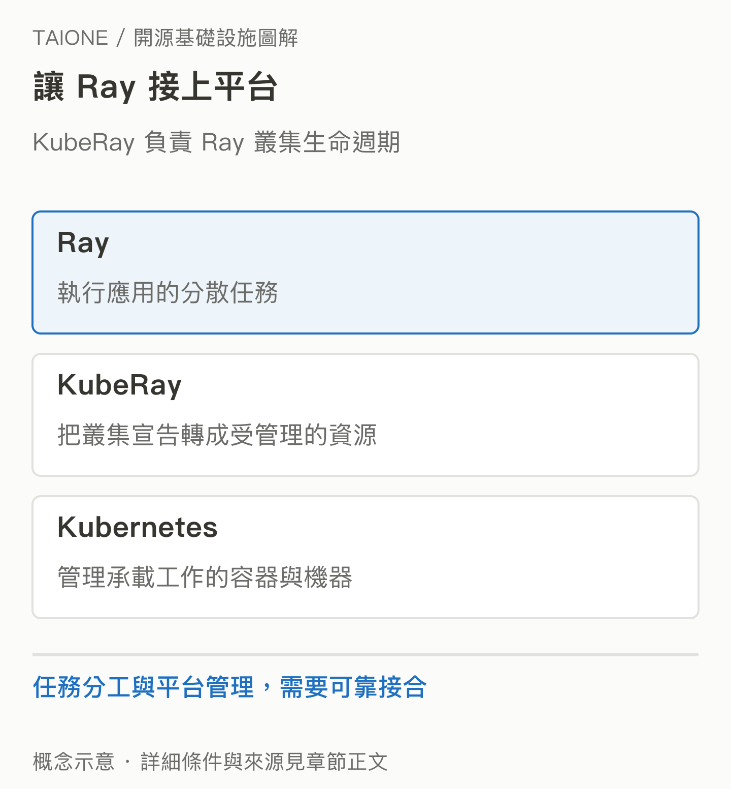
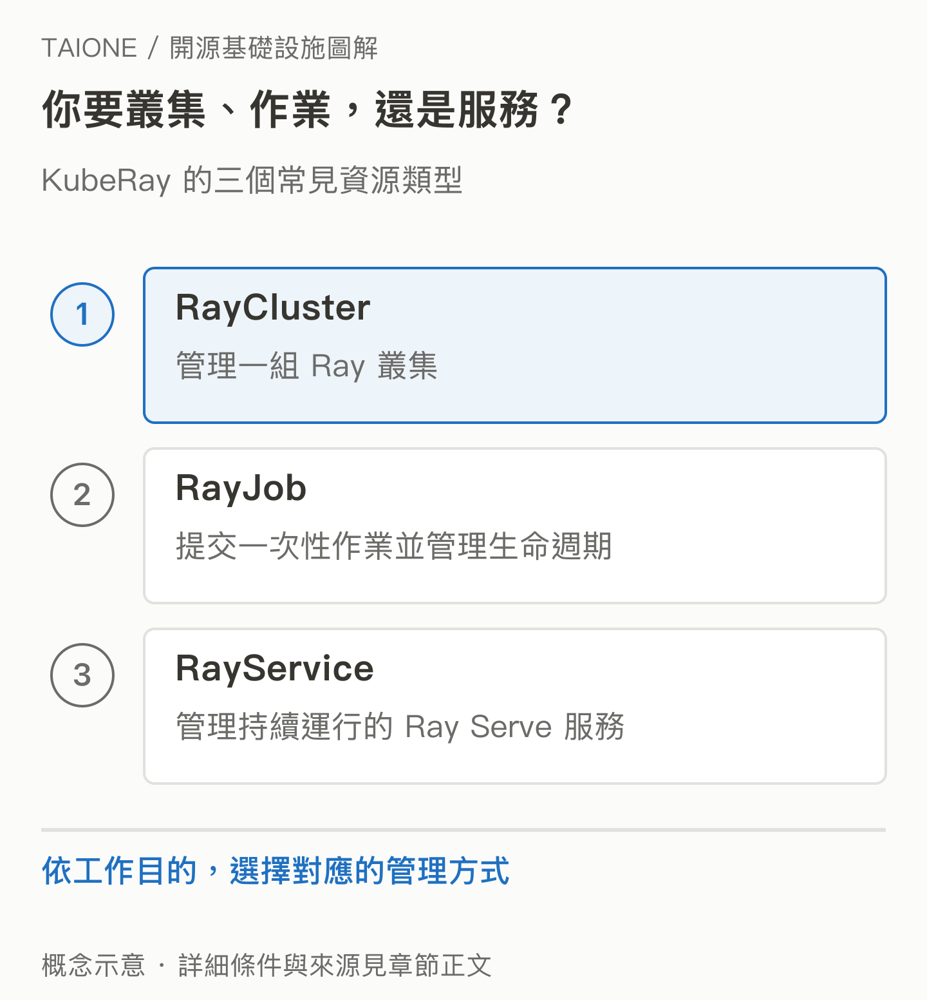

# 10｜KubeRay：Ray 會分工了，為什麼還需要另一個專案？

<!-- BOOK-NAV-START -->

第三篇 · 算力與系統管理 · 第 **10 / 18** 章

| [**← 第 09 章**](09-yunikorn.md) | [**回總目錄**](../README.md#閱讀目錄) | [**第 11 章 →**](11-kafka.md) |
| :--- | :---: | ---: |

<!-- BOOK-NAV-END -->
**KubeRay 把 Ray 叢集的建立、更新與生命週期接進 Kubernetes，讓應用運算與平台管理能協同工作。**

## 程式跑得動，服務還要有人照顧

讀過 [Ray](07-ray.md) 與 [Kubernetes](08-kubernetes.md)，可以把問題分成兩層：Ray 知道應用要分派哪些任務；Kubernetes 知道容器應在哪裡運行。但誰來把「我需要一組 Ray 工作者」變成一整組正確的 Kubernetes 資源，並在設定改變後持續管理？

KubeRay 的 Operator 就負責這種接合。Operator 可以理解為懂得某種應用的自動管理程式；KubeRay 觀察宣告的 Ray 資源，再協調需要的 Pod 等物件。[Ray on Kubernetes 官方說明](https://docs.ray.io/en/latest/cluster/kubernetes/index.html)

*三者各有責任；接合之後也沒有消除應用設計與維運責任。* [SVG 原圖](../assets/figures/10-a.svg)

## 為什麼需要不同的資源類型？

有時你只要一個可反覆使用的叢集；有時是跑完就收工的一次性作業；有時則是持續接收請求的模型服務。KubeRay 的常見介面分別用 RayCluster、RayJob 與 RayService 表達這些需求。它們讓平台可以管理工作生命週期，不必每個團隊各寫一套啟停腳本。[專案介紹](https://github.com/ray-project/kuberay)

*依目的選擇資源類型；具體重試、清理與復原行為仍要按版本與設定確認。* [SVG 原圖](../assets/figures/10-b.svg)

## 為什麼連接層也值得公司養人？

Google Cloud 與 Anyscale 公開說明共同參與 KubeRay，以支援 Kubernetes 上的開源 Ray 部署。Google 也發表 GKE 整合方案，將日誌、監控與權限等平台能力接進來。對雲端公司，這能降低客戶採用分散式 AI 的障礙；對 Ray 生態，則擴大可運行的環境。[合作說明](https://cloud.google.com/blog/products/containers-kubernetes/partnering-with-anyscale-to-integrate-rayturbo-with-gke)、[GKE 整合範例](https://cloud.google.com/blog/products/containers-kubernetes/use-ray-on-kubernetes-with-kuberay)

這也解釋為何 Ray 與 KubeRay 可以分成兩個 Track：一個深入分散執行，一個深入系統接合及可靠營運。分開不表示互不相干。

## 維護者需要照顧兩端的變動

KubeRay 屬於 Ray 整體專案的一部分，貢獻者透過公開 Issue、設計討論與 PR 協作。貢獻規則要求功能附上文件、單元測試與端到端測試，因為兩端版本或物件狀態改變，都可能造成看似細小卻影響整個叢集的問題。[貢獻指南](https://github.com/ray-project/kuberay/blob/master/CONTRIBUTING.md)

對台灣人才的可能價值，是學會跨專案定位故障，把單一環境的問題轉成其他團隊也能使用的修正。這種能力的影響力來自接合品質，並不需要另外發明一套模型。

**證據界線：**合作與整合文件支持企業參與，不能推出所有企業都採用同一部署。KubeRay 支援的恢復能力有條件；資料、應用狀態與安全設定仍需另外設計。

<!-- BOOK-NAV-START -->

---

接著讀：**11｜Kafka：剛發生的事，怎麼讓很多系統一起知道？**。

| [**← 第 09 章**](09-yunikorn.md) | [**回總目錄**](../README.md#閱讀目錄) | [**第 11 章 →**](11-kafka.md) |
| :--- | :---: | ---: |

<!-- BOOK-NAV-END -->
