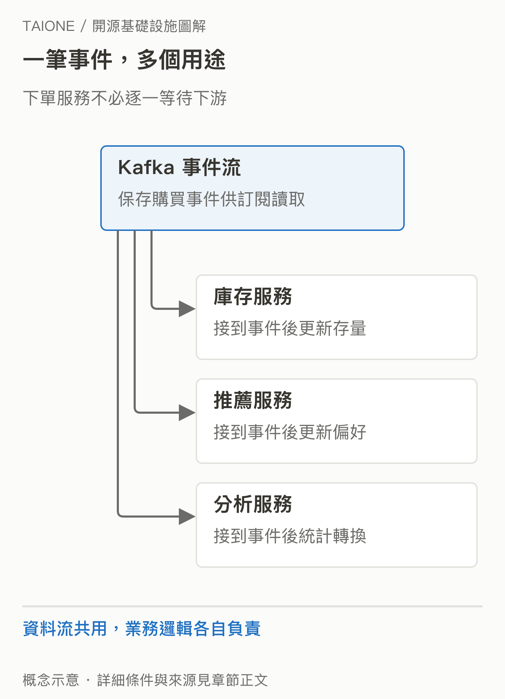
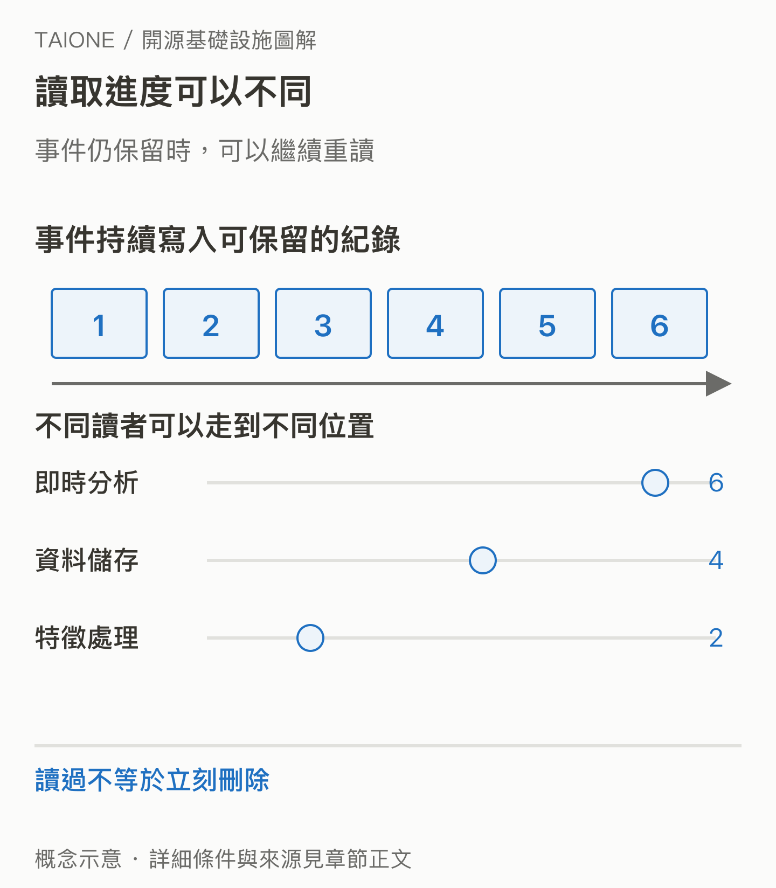

# 11｜Kafka：剛發生的事，怎麼讓很多系統一起知道？

<!-- BOOK-NAV-START -->

第四篇 · 資料的流動與計算 · 第 **11 / 18** 章

| [**← 第 10 章**](10-kuberay.md) | [**回總目錄**](../README.md#閱讀目錄) | [**第 12 章 →**](12-ozone.md) |
| :--- | :---: | ---: |

<!-- BOOK-NAV-END -->
**Apache Kafka 把持續發生的事件保存成可訂閱、可重讀的資料流，讓不同系統各自處理同一批新資訊。**

## 一筆訂單，很多團隊都想知道

想像使用者按下「購買」。庫存要扣量，推薦系統要更新偏好，分析團隊要計算轉換。如果每個系統都直接接到下單服務，新增一個用途就得再接一條線。Kafka 提供共同事件入口：來源寫入，消費者各自訂閱；來源不必等所有下游完成才繼續。[官方介紹](https://kafka.apache.org/intro/)

*這是情境示例；Kafka 提供資料流，扣庫存或推薦邏輯仍由應用程式負責。 [SVG 原圖](../assets/figures/11-a.svg)*

## 為什麼「可以重讀」很重要？

事件會依設定保留，不會被第一個讀取者拿走就消失。某個分析程式停機後，可以從自己記住的位置接著讀；新模型也能在資料仍保留時重算。事件會分散到多個分區，**順序保證以分區為範圍**，不能想成所有機器共用一條絕對時間線。[事件與分區概念](https://kafka.apache.org/intro/)

放在 AI 系統裡，它可以傳遞新交易、設備訊號或使用回饋，讓後續的特徵更新與分析不必等人工搬資料。這是資料新鮮度與系統解耦的價值；Kafka 本身不會把事件自動變成可靠的模型知識。

*各消費者有自己的讀取進度；能回讀多久，受資料保留設定限制。 [SVG 原圖](../assets/figures/11-b.svg)*

## 企業為什麼願意持續投入？

Kafka 源自 LinkedIn 的內部需求。LinkedIn 的工程文章說明，他們為正式環境維護版本分支，也努力把適合的修補送回上游；有些內部改動可能不被社群接受。這很具體地顯示：企業付薪解決自己的可靠性問題，同時還得說服公共專案接受通用的解法。[LinkedIn 工程案例，2019](https://www.linkedin.com/blog/engineering/open-source/apache-kafka-trillion-messages)

## 維護者在影響什麼？

重大介面與行為變更要經 Kafka Improvement Proposal（KIP）討論。維護者需要判斷資料可靠性、相容性、效能與升級成本；資格來自持續貢獻及技術判斷，由 Kafka PMC 評估。[開發與貢獻規則](https://kafka.apache.org/community/developer/)

本書的分析是：台灣若有更多人能把真實串流問題轉成上游改進，就能更深入參與資料交換系統的演進。上述企業案例支持實際採用與回饋，並不證明目前全球市占，也不代表選 Kafka 就一定有即時或不遺失資料的保證；結果仍取決於整體應用與設定。

<!-- BOOK-NAV-START -->

---

接著讀：**12｜Ozone：資料越堆越多，底下的倉庫誰來顧？**。

| [**← 第 10 章**](10-kuberay.md) | [**回總目錄**](../README.md#閱讀目錄) | [**第 12 章 →**](12-ozone.md) |
| :--- | :---: | ---: |

<!-- BOOK-NAV-END -->
