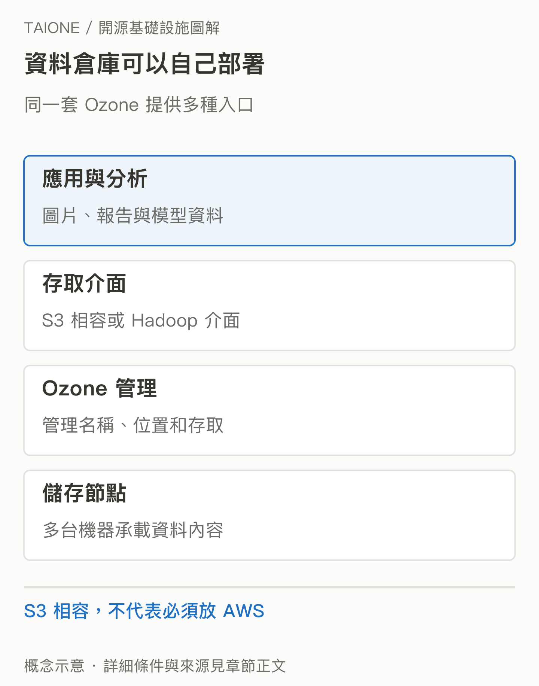
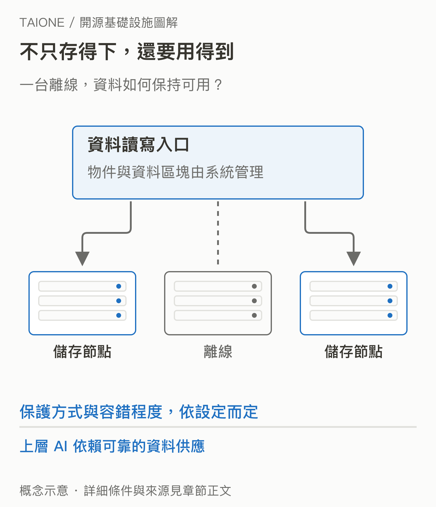

# 12｜Ozone：資料越堆越多，底下的倉庫誰來顧？

<!-- BOOK-NAV-START -->

第四篇 · 資料的流動與計算 · 第 **12 / 18** 章

| [**← 第 11 章**](11-kafka.md) | [**回總目錄**](../README.md#閱讀目錄) | [**第 13 章 →**](13-datafusion.md) |
| :--- | :---: | ---: |

<!-- BOOK-NAV-END -->
**Apache Ozone 是可自行部署的分散式物件儲存系統，處理大量資料的存放、讀取與故障復原，為分析和 AI 提供儲存底座。**

## 先別急著訓練模型，資料放得下嗎？

想像團隊累積了多年圖片、報告、機器紀錄與處理結果。困難不只是硬碟總容量：檔案很多時，怎麼找到它們？一台伺服器故障，資料還能讀嗎？原有分析工具能接上嗎？Ozone 將資料分散到多個節點，並提供 S3 相容介面與 Hadoop 檔案系統介面。[官方功能介紹](https://ozone.apache.org/)

*多個入口服務同一個儲存系統；S3 相容介面不表示資料必須放在 AWS。 [SVG 原圖](../assets/figures/12-a.svg)*

## 儲存系統的工作，不只是「存一份」

你可以把物件理解成有名稱的一包資料。系統除了保管內容，還要管理名稱、位置與權限等資訊。Ozone 把命名空間與資料區塊管理分層，並以複本或糾刪碼等機制處理容錯需求。糾刪碼可以粗略理解成加入可復原的冗餘資料，代價與多份完整複製不同。[Cloudera 技術文件](https://docs.cloudera.com/cdp-private-cloud-base/7.3.2/ozone-overview/topics/ozone-introduction.html)

對 AI 而言，訓練與批次處理需要持續取得資料。若儲存供應跟不上，昂貴的運算資源可能在等待。這是本書對儲存層重要性的推論；Ozone 是否改善某套系統，仍要量測其資料大小、讀寫方式和網路條件。

*圖中的離線節點不再正常提供資料；能承受多少故障，取決於複本、糾刪碼與其他系統條件。 [SVG 原圖](../assets/figures/12-b.svg)*

## 企業的投入，有不同角色

官方使用者頁列出 Tencent、Shopee、Preferred Networks、Cloudera 等組織與部分案例連結；這是採用線索，不等同每家公司都有治理席次。Cloudera 另有工程文章說明其 Ozone 寫入路徑開發，可支持技術投入的關係。不能只看公司標誌就把「使用者」寫成「共同擁有者」。[使用者清單](https://ozone.apache.org/community/who-uses-ozone/)、[Cloudera 寫入管線案例](https://www.cloudera.com/blog/technical/ozone-write-pipeline-v2-with-ratis-streaming.html)

## 為什麼需要更多維護者？

儲存錯誤可能影響很多上層服務。除了增加功能，還得重現故障、修復一致性問題、測試升級與改善監控文件。官方也接受測試、文件與問題回報等貢獻。[參與指南](https://ozone.apache.org/community/how-to-contribute/)

本書的分析是：這類人才讓台灣團隊具備理解、維修與調整儲存底層的能力。它支持自主選擇部署與改善問題，卻不代表自行維運必然更省錢，也沒有證據顯示所有 AI 團隊都應改用 Ozone。

<!-- BOOK-NAV-START -->

---

接著讀：**13｜DataFusion：做資料產品，查詢引擎一定要自己重寫嗎？**。

| [**← 第 11 章**](11-kafka.md) | [**回總目錄**](../README.md#閱讀目錄) | [**第 13 章 →**](13-datafusion.md) |
| :--- | :---: | ---: |

<!-- BOOK-NAV-END -->
