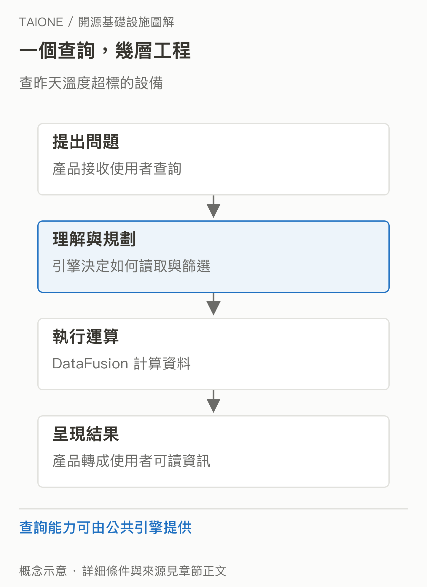
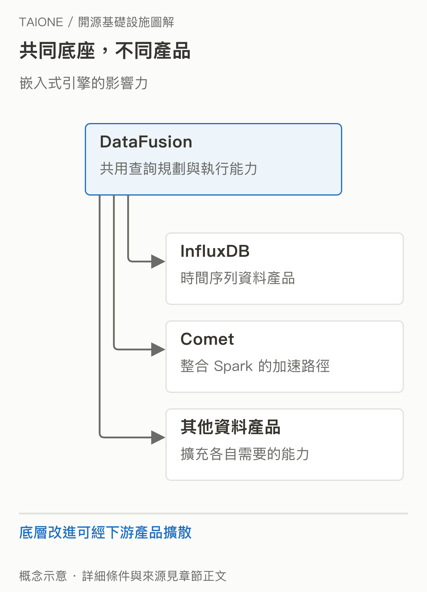

# 13｜DataFusion：做資料產品，查詢引擎一定要自己重寫嗎？

<!-- BOOK-NAV-START -->

第四篇 · 資料的流動與計算 · 第 **13 / 18** 章

| [**← 第 12 章**](12-ozone.md) | [**回總目錄**](../README.md#閱讀目錄) | [**第 14 章 →**](14-comet.md) |
| :--- | :---: | ---: |

<!-- BOOK-NAV-END -->
**Apache DataFusion 提供可嵌入、可擴充的查詢引擎，讓不同資料產品共用「理解查詢、規劃計算、執行運算」的底層能力。**

## 看似簡單的篩選，背後有很多工程

假設你要做設備監控產品，讓客戶查「昨天超過溫度門檻的機台」。介面只需要一個搜尋框，底下卻得理解條件、讀取資料、決定先篩選還是先關聯，再有效率地算出結果。每家公司從頭寫這些通用能力，會重複投入許多成本。DataFusion 以 Rust 實作，使用 Arrow 記憶體格式，讓產品團隊選擇或擴充需要的部分。[官方介紹](https://datafusion.apache.org/user-guide/introduction.html)

*產品功能與通用查詢能力可以分工；DataFusion 不包辦整個資料庫產品。 [SVG 原圖](../assets/figures/13-a.svg)*

## 「被別人嵌入」也是一種全球影響力

使用者不一定看見 DataFusion 的名字，卻可能透過建立在它上面的產品使用它。官方列出的系統包含 InfluxDB、Comet、Lance 等；它們並非同一種產品。DataFusion 的意義在於讓共同能力持續改進，產品團隊再專注於特定資料、介面與業務需求。[用途與已知使用者](https://datafusion.apache.org/user-guide/introduction.html)

InfluxData 的產品文件確認 InfluxDB 3 的 SQL 查詢以 DataFusion 為基礎，並加上時間序列功能。這是「商業資料庫採用公共引擎」的具體例子，不能直接推論所有 DataFusion 開發都由 InfluxData 支付。[InfluxDB 3 查詢文件](https://docs.influxdata.com/influxdb3/enterprise/get-started/query/)

*共用底層降低重複建設，也讓底層變更可能同時影響多個下游。 [SVG 原圖](../assets/figures/13-b.svg)*

## 企業出人，專案如何決定？

DataFusion 的治理文件列出來自 InfluxData、Apple、LanceDB 等組織的個人參與者，也明確採 Apache 治理方式，盡可能以共識決策，獨立於商業利益。公司聘用的工程師可以參與，但公司關係不等於一家公司有最終否決權。[治理文件](https://datafusion.apache.org/contributor-guide/governance.html)

## 這個 Track 培養的是哪種能力？

維護者需要理解 SQL 的意義、查詢計畫、效能與相容性。例如把篩選提早，可能省下大量計算；但改寫必須保持結果正確。對台灣的潛在價值，是能把產品需求轉成可供多個系統重用的引擎能力，而不只是停在呼叫 API。本章的企業與產品關係有公開證據；「因此能增加台灣影響力」則是有條件的分析，仍需長期貢獻與下游採用。

下一章的 [Comet](14-comet.md) 就是具體延伸：DataFusion 提供引擎，Comet 處理它與 Spark 之間的整合。兩個 Track 有共同基礎，但面對的貢獻問題不同。

<!-- BOOK-NAV-START -->

---

接著讀：**14｜Comet：能不能保留 Spark，用更少資源完成查詢？**。

| [**← 第 12 章**](12-ozone.md) | [**回總目錄**](../README.md#閱讀目錄) | [**第 14 章 →**](14-comet.md) |
| :--- | :---: | ---: |

<!-- BOOK-NAV-END -->
