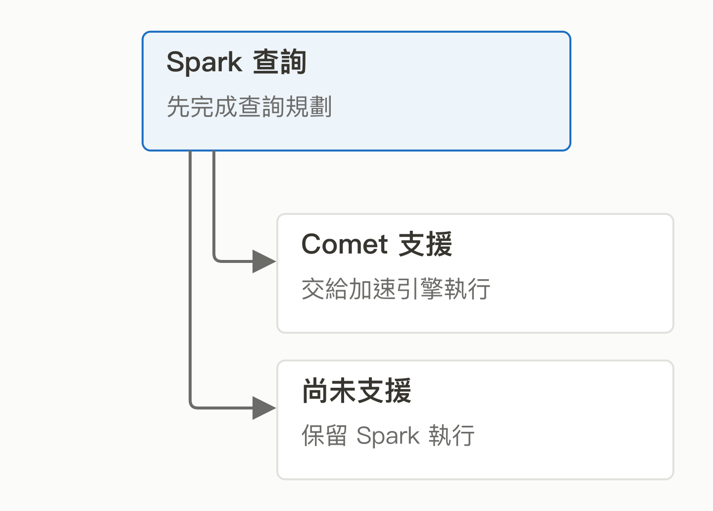
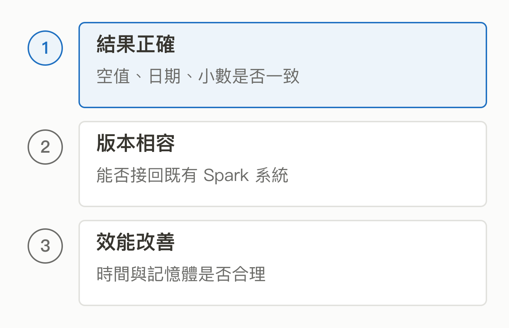

# 14｜Comet：能不能保留 Spark，用更少資源完成查詢？

<!-- BOOK-NAV-START -->

第四篇 · 資料的流動與計算 · 第 **14 / 18** 章

| [**← 第 13 章**](13-datafusion.md) | [**回總目錄**](../README.md#閱讀目錄) | [**第 15 章 →**](15-airflow.md) |
| :--- | :---: | ---: |

<!-- BOOK-NAV-END -->
**Apache DataFusion Comet 把高效率的執行引擎接進 Spark，嘗試在保留既有使用方式的同時，降低資料處理的時間與資源成本。**

## 問題：公司已經有很多 Spark 工作

想像一家公司每天整理交易、點擊與模型訓練資料。分析師早已寫好 Spark SQL，工程團隊也建立了排程與監控。即使另一個引擎更快，全面重寫仍可能很貴。Comet 切入的就是這個問題：讓既有查詢沿用 Spark 的介面與規劃能力，再替可支援的運算換上不同的執行方式。[專案介紹](https://datafusion.apache.org/comet/contributor-guide/plugin_overview.html)

*圖 14-1｜同一份查詢，兩種執行路徑。同一份查詢可以包含不同執行路徑；這是概念圖，並非每個工作都能全部加速。* [SVG 原圖](../assets/figures/14-a.svg)

## 加速的關鍵，是把資料怎麼算做得更好

Comet 借助上一章的 [DataFusion](13-datafusion.md)，用 Rust 原生程式與 Arrow 欄式資料處理支援的工作。欄式處理可以想成一次處理一批資料中的同一欄，減少逐筆搬動與轉換的負擔。新版也包含直接處理 Arrow 批次的 JVM 路徑，因此不能簡化成「所有程式都改成 Rust」。[官方程式庫說明](https://github.com/apache/datafusion-comet)

對 AI 的影響往往發生在模型之前：準備訓練資料、清理紀錄或評估輸出時，運算效率會影響等待時間與成本。但 Comet 不是模型推論引擎，也不會讓所有 AI 工作自動變快。

## Apple 為什麼把它交給開源社群？

Apache 在 2024 年的捐贈公告確認：Comet 最初由 Apple 開發，參與工程師也貢獻 Arrow 與 DataFusion；公告將擴大社群與加速開發列為引入 ASF 的目的。這支持「企業把內部需求做成共同基礎」的例子，不能推論 Apple 擁有全部治理權，或其他企業已全面採用。[官方捐贈公告](https://arrow.apache.org/blog/2024/03/06/comet-donation/)

*圖 14-2｜快以外，還要守住什麼？更快只是其中一項；算對、能接回原有系統，同樣需要持續維護。* [SVG 原圖](../assets/figures/14-b.svg)

## 這個 Track 為何值得培養人？

維護者要處理日期、空值、小數等語意，補齊尚未支援的運算，並檢查新版本是否破壞既有結果。官方列出的參與方式也包括重現問題、測試既有 Spark 工作、審查與文件。對台灣而言，本書的分析是：這能培養理解資料系統成本與正確性的工程能力，逐步參與上游相容性與效能取捨。[貢獻指南](https://datafusion.apache.org/comet/contributor-guide/contributing.html)

> [!NOTE]
> 官方的效能測試只支持特定版本、硬體與工作負載。本章不把測試倍數當普遍保證；不支援功能可回退，也不等於完全沒有相容性風險。導師環境與新手任務品質仍需另外確認。

<!-- BOOK-NAV-START -->

---

接著讀：**15｜Airflow：每天都要跑的資料流程，誰來盯著？**。

| [**← 第 13 章**](13-datafusion.md) | [**回總目錄**](../README.md#閱讀目錄) | [**第 15 章 →**](15-airflow.md) |
| :--- | :---: | ---: |

<!-- BOOK-NAV-END -->
