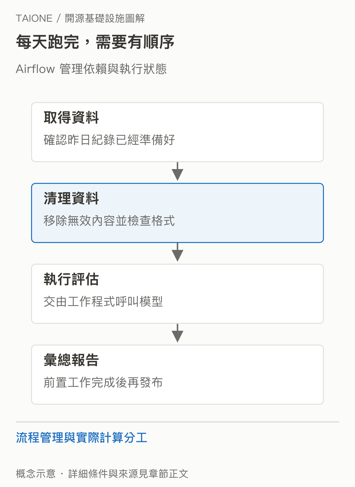
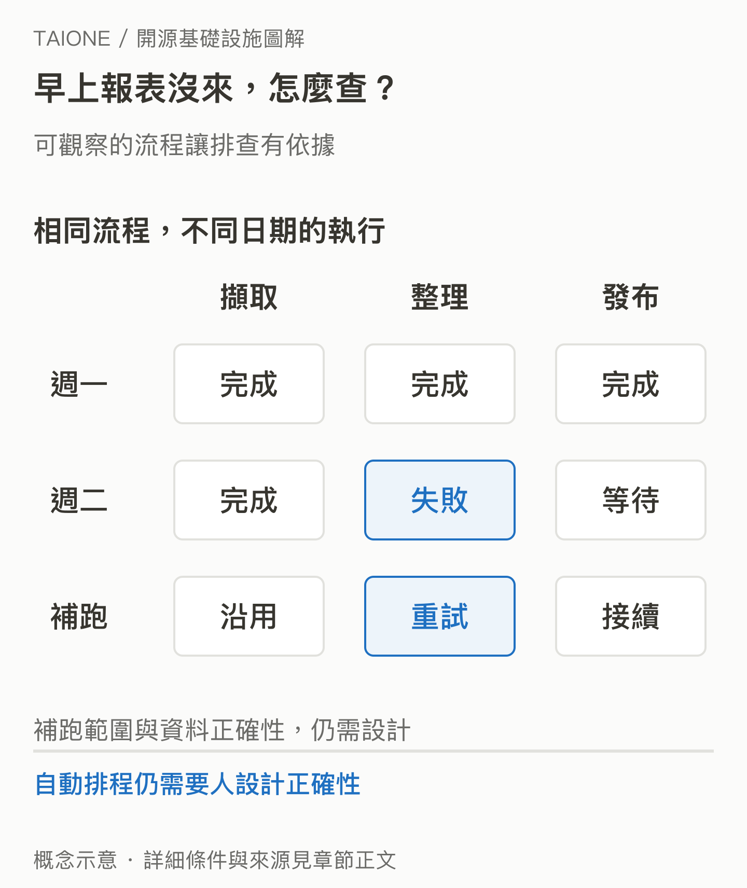

# 15｜Airflow：每天都要跑的資料流程，誰來盯著？

<!-- BOOK-NAV-START -->

第五篇 · 可靠的工作流程 · 第 **15 / 18** 章

| [**← 第 14 章**](14-comet.md) | [**回總目錄**](../README.md#閱讀目錄) | [**第 16 章 →**](16-flyte.md) |
| :--- | :---: | ---: |

<!-- BOOK-NAV-END -->
**Apache Airflow 用程式定義工作步驟與依賴，協助排程、執行和追蹤流程，讓團隊能管理重複發生的資料工作。**

## 每天的報表，不能只靠一支腳本

想像一個每天更新的 AI 評估報告：先取得昨日紀錄，再清理資料，接著呼叫模型，最後彙總結果。資料還沒到就先算，結果可能不完整；第三步失敗，整支重跑又可能重複寫入。Airflow 用 Python 定義工作流程，記錄步驟狀態，讓人知道卡在哪裡，也能依條件重跑失敗工作。[官方介紹](https://airflow.apache.org/docs/apache-airflow/stable/index.html)

*箭頭表示前後依賴；模型呼叫與資料計算仍由工作程式或外部系統完成。 [SVG 原圖](../assets/figures/15-a.svg)*

## 排程工具為什麼會成為基礎設施？

當公司有很多流程，問題會從「今天有沒有跑」變成「哪批資料還沒完成、改版後怎麼補算、出錯由誰接手」。Airflow 將這些工作放進共同的管理方式，並透過整合元件連接不同服務。它可以管理明確起訖的批次工作，也能由事件觸發；持續不斷的事件傳輸則是 [Kafka](11-kafka.md) 那一類問題。[工作流程與適用情境](https://airflow.apache.org/docs/apache-airflow/stable/index.html)

*自動排程減少盯人，但資料是否正確、重跑是否重複扣款，仍需工作作者設計。 [SVG 原圖](../assets/figures/15-b.svg)*

## Airbnb 的需求，如何變成公共專案？

Airflow 於 2014 年在 Airbnb 啟動，2016 年進入 Apache 孵化，2019 年成為頂級專案。企業起源說明問題從哪裡來，現在的公共維護則有自己的社群與治理流程。[專案歷史](https://airflow.apache.org/docs/apache-airflow/stable/project.html)

大型變更可透過 Airflow Improvement Proposal（AIP）公開討論；開發郵件清單用來發布提案與投票。這表示一家公司想加功能，需要提出其他使用者也能接受的設計，而不只是把內部需求直接放進去。[社群參與方式](https://airflow.apache.org/community/)

## 維護者的判斷會影響很多團隊

維護工作包含排程行為、失敗恢復、外部服務整合與升級相容性。這些功能若改壞，使用者可能早上才發現整夜流程沒有完成。對台灣而言，本書的分析是：這條路能把資料工程的操作經驗轉成上游設計與可靠性能力，幫助更多團隊把 AI 從單次實驗變成可持續運作的流程。

公開歷史與社群機制支持上述描述，但不能單憑起源與整合數量宣稱全球領先。Airflow 與下一章 Flyte 有功能交集，差異要回到工作型態、執行模型與團隊需求，不能只用「資料工程／AI」硬切兩邊。

<!-- BOOK-NAV-START -->

---

接著讀：**16｜Flyte：AI 實驗變成長時間工作後，怎麼可靠地跑？**。

| [**← 第 14 章**](14-comet.md) | [**回總目錄**](../README.md#閱讀目錄) | [**第 16 章 →**](16-flyte.md) |
| :--- | :---: | ---: |

<!-- BOOK-NAV-END -->
