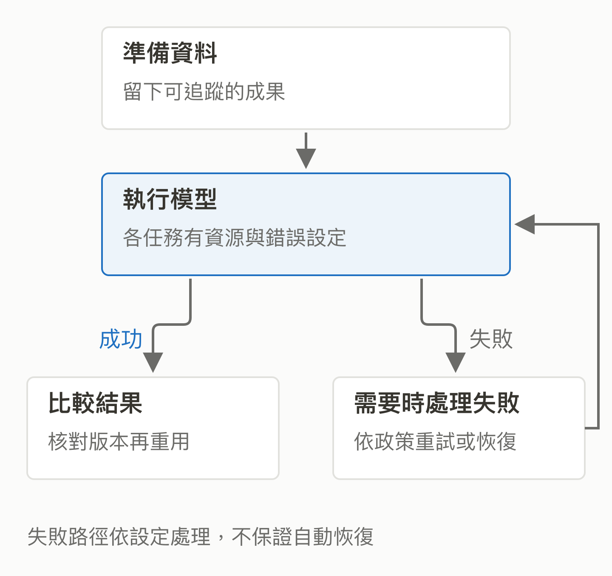
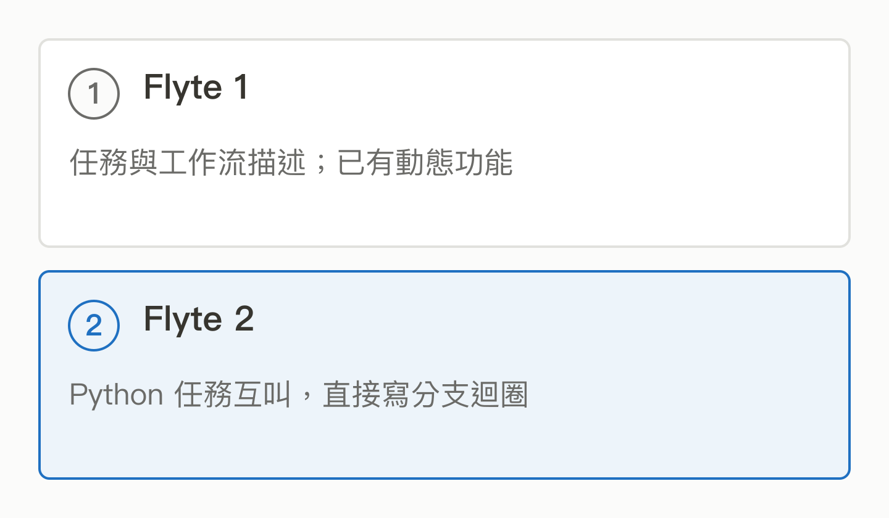

# 16｜Flyte：AI 實驗變成長時間工作後，怎麼可靠地跑？

<!-- BOOK-NAV-START -->

第五篇 · 可靠的工作流程 · 第 **16 / 18** 章

| [**← 第 15 章**](15-airflow.md) | [**回總目錄**](../README.md#閱讀目錄) | [**第 17 章 →**](17-why-these-tracks.md) |
| :--- | :---: | ---: |

<!-- BOOK-NAV-END -->
**Flyte 管理 AI 與資料工作的執行、狀態及資源，讓團隊能把 Python 邏輯變成可追蹤、可恢復的工作流程。**

## 實驗成功一次，離團隊每天使用還有多遠？

想像你要處理很多文件、跑不同模型，再比較答案。這次只改了評估方法，前面的昂貴步驟要不要重算？某個模型執行失敗，怎麼知道做到哪裡？Flyte 處理的是這些執行問題：依設定管理快取、重試與錯誤，並呈現各步驟狀態。快取必須反映資料、程式與設定，不能把舊結果誤當新實驗。[Flyte 2 功能說明](https://flyte.org/platform/flyte-2-is-here)

*圖 16-1｜實驗中斷，成果如何保留？這是工作管理的概念示例；能否重用結果與如何恢復，取決於作者設定。* [SVG 原圖](../assets/figures/16-a.svg)

## 先分清 Flyte 1 與 Flyte 2

Flyte 1 常見的寫法是將任務與工作流程編譯成系統可執行的描述，並已有 dynamic workflows 等能力。Flyte 2 強調由任務直接呼叫任務，用一般 Python 的條件、迴圈與非同步控制流程，讓執行中的判斷更自然地進入工作流。不能把舊版簡化為「完全不會動態」，也不能把新版畫成只會依固定圖跑到底。[Flyte 1 進階組合](https://docs-flyte-legacy.union.ai/en/v1.13.3/user_guide/advanced_composition/index.html)、[官方版本比較](https://flyte.org/flyte1-vs-flyte2)

*圖 16-2｜版本改變了撰寫模型。比較的是主要撰寫模型，不是宣稱舊版沒有分支或動態功能。* [SVG 原圖](../assets/figures/16-b.svg)

## 從 Lyft 到基金會，再到商業服務

Flyte 最初由 Lyft 開發並開源，後來加入 LF AI & Data Foundation。基金會公告把多組織貢獻與公開治理列為其畢業的依據。Union.ai 提供建立於這個生態的商業平台，官方網站也由 Union 團隊發布新版訊息。這幾種關係不同：起源、基金會歸屬與商業提供者不能混成一個擁有者。[基金會公告，2022](https://lfaidata.foundation/blog/2022/01/20/lf-ai-data-foundation-announces-graduation-of-flyte-project/)

## 培養維護者，要學會對什麼負責？

除了寫 Python 任務，開發 Flyte 本身還涉及執行狀態、資源管理、資料型別、相容性與介面。治理文件區分 Committer、Maintainer 和 Steering Committee；維護者要審查品質、協助發布與帶新人，而方向決策另有相應權責。[治理規則](https://github.com/flyteorg/community/blob/main/GOVERNANCE.md)

這份治理文件也說明，現行一般 Maintainer 角色要求把維護 Flyte 作為主要工作責任，目的是避免志工在下班後承擔過重負荷；技術指導委員會成員另有例外。這是 Flyte 的現行安排，也具體說明了為什麼企業願意付薪、讓人持續維護，會影響社群能承擔多少責任。[Maintainer 的工作安排](https://github.com/flyteorg/community/blob/main/GOVERNANCE.md)

本書的分析是：台灣團隊若能把真實 AI 流程的失敗模式整理成通用改善，就有機會影響其他團隊使用的工作流能力。這比「會用工具」更進一步，但沒有自動取得維護者資格的捷徑。

> [!NOTE]
> 本章介紹專案方向，不替特定版本做部署承諾。Flyte 2 的公開網站、歷史公告與程式庫對後端成熟度的更新節奏不同；實際參與前需向 Track Lead 確認版本與目標模組。開源功能與 Union 商業服務也須分開核對。[目前程式庫](https://github.com/flyteorg/flyte)

<!-- BOOK-NAV-START -->

---

接著讀：**17｜現在能回答：為什麼選這 11 個嗎？**。

| [**← 第 15 章**](15-airflow.md) | [**回總目錄**](../README.md#閱讀目錄) | [**第 17 章 →**](17-why-these-tracks.md) |
| :--- | :---: | ---: |

<!-- BOOK-NAV-END -->
