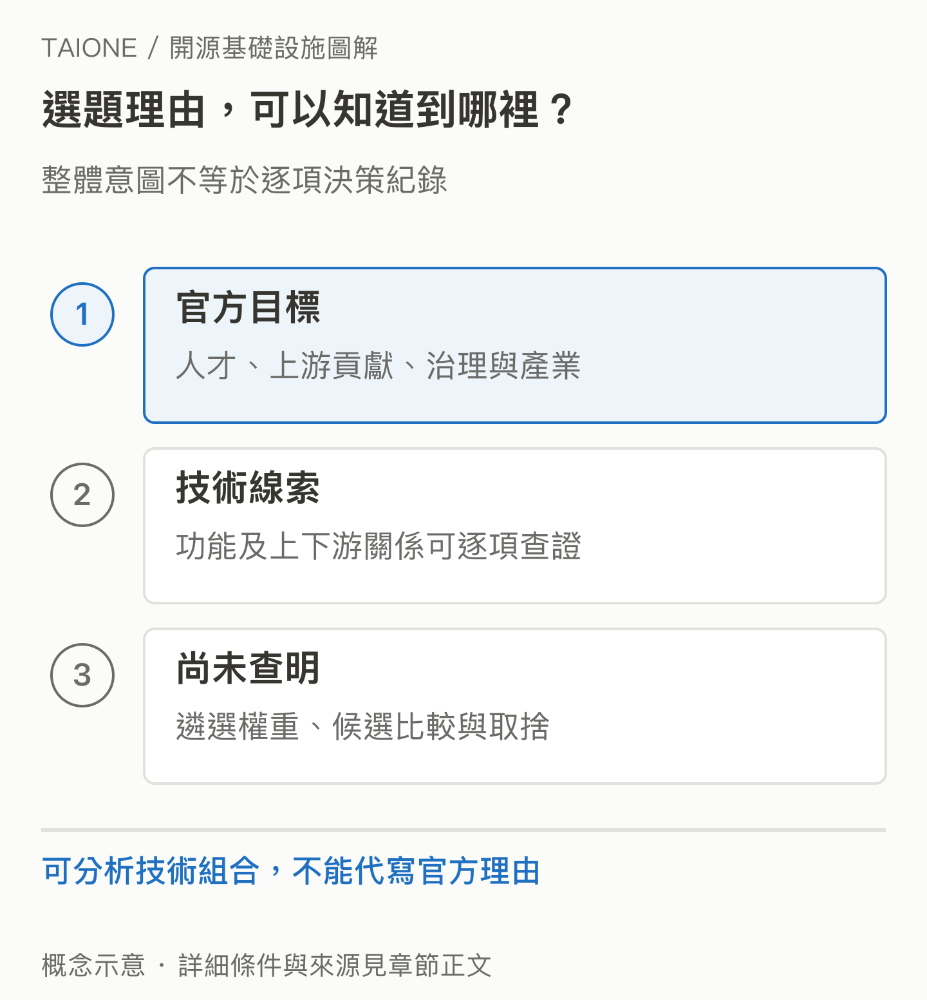

# 17｜現在能回答：為什麼選這 11 個嗎？

<!-- BOOK-NAV-START -->

第六篇 · 回到計畫意圖 · 第 **17 / 18** 章

| [**← 第 16 章**](16-flyte.md) | [**回總目錄**](../README.md#閱讀目錄) | [**第 18 章 →**](18-maintainers-and-taiwan.md) |
| :--- | :---: | ---: |

<!-- BOOK-NAV-END -->
**可以看出它們涵蓋關鍵工程問題，也能理解人才培育的策略；但本次查閱的官方資料，未提供完整的逐項選題理由。**

## 先把已知與推論拆開

已知的是：TAIONE 將這份名單稱為 Strategic Tracks，涵蓋推論、雲原生運算、工作流與資料系統；Fellowship 明確希望培養核心貢獻與治理能力。[官方名單](https://taione.org/fellowship/tracks)、[計畫目的](https://taione.org/fellowship/about)

尚不知道的是：遴選時如何衡量技術趨勢、台灣產業需求、導師能量與候選專案成熟度，以及哪些專案曾被比較或排除。因此，本章提出的是由公開資料支持的解讀，不替主辦方編出一份內部戰略會議紀錄。

有明確的整體意圖，仍不等於知道每項取捨；證據層次要分開。[SVG 原圖](../assets/figures/17-a.svg)

## 第一條線索：投入能被多人沿用的能力

這些專案大多處理會跨公司重複出現的問題：有限算力如何有效使用、大量資料如何可靠處理、多步驟工作如何持續運作。若改進進入上游、發布並被下游採用，價值就可能跨越單一產品。

這是本書對技術位置的分析。它說明「為什麼值得研究這些方向」，卻不能直接證明其中每一個都不可替代，更不能證明未入選的專案不重要。不同問題也有不同方案，關鍵在具體情境與證據。

## 第二條線索：關注能力之間的接合

名單同時包含 Ray 與 KubeRay、DataFusion 與 Comet。KubeRay 官方文件說明它管理 Ray 在 Kubernetes 上的運行；Comet 則把加速能力接入已有的 Spark 工作。[KubeRay 的責任](https://docs.ray.io/en/latest/cluster/kubernetes/index.html)、[Comet 的目標](https://datafusion.apache.org/comet/)

這使我們可以提出一個合理解讀：名單不只關注單一引擎，也涵蓋技術走進實際環境時的接合問題。但「主辦方刻意採取這套布局」仍需要更直接的選題說明才能確認。

## 第三條線索：把國際貢獻變成可持續的路

官方以 Track Lead、審查、討論與在地社群降低參與門檻。這提示我們，技術方向之外，「是否有人能帶、能不能持續承擔真實任務」也可能影響執行可行性。導師資源究竟在選題中占多大權重，目前沒有公開證據。

較穩健的結論是：這份名單提供台灣開發者進入多種重要工程問題的入口；它的成效要看能否形成持續貢獻與責任承擔。對讀者而言，值得追問的是各 Track 目前有哪些實際問題、誰能協助新手，以及這些問題連到哪些使用需求。

**證據限制：**本章的三條線索不是官方逐項遴選理由，也不是全球專案排名。基金會意圖、專案技術價值與已實現的人才或產業成果，必須分開判斷。

<!-- BOOK-NAV-START -->

---

接著讀：**18｜多一些維護者，台灣究竟能多出什麼能力？**。

| [**← 第 16 章**](16-flyte.md) | [**回總目錄**](../README.md#閱讀目錄) | [**第 18 章 →**](18-maintainers-and-taiwan.md) |
| :--- | :---: | ---: |

<!-- BOOK-NAV-END -->
