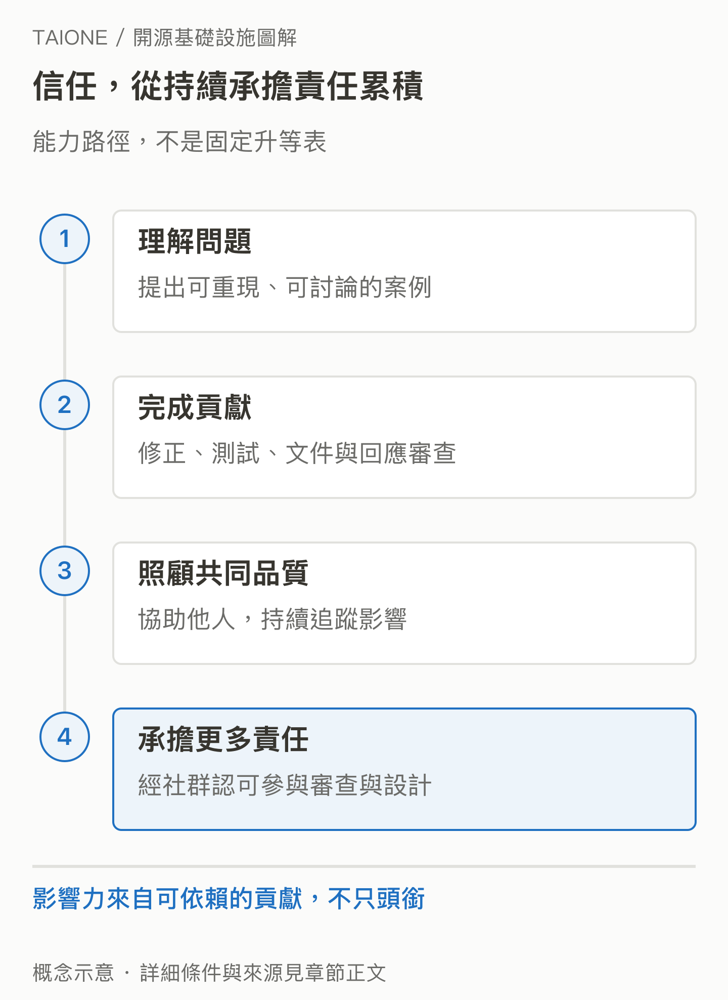

# 18｜多一些維護者，台灣究竟能多出什麼能力？

<!-- BOOK-NAV-START -->

第六篇 · 回到計畫意圖 · 第 **18 / 18** 章

| [**← 第 17 章**](17-why-these-tracks.md) | [**回總目錄**](../README.md#閱讀目錄) | [**來源索引 →**](../SOURCES.md) |
| :--- | :---: | ---: |

<!-- BOOK-NAV-END -->
**可能增加的是理解、修正與共同決定關鍵軟體的能力，而這種影響力需要長期貢獻和社群信任。**

## 影響力從承擔問題開始

想像一位工程師先回報一個查詢錯誤，接著補出重現案例與測試，再協助確認別人的修正。幾個月後，她更理解系統的限制，也能讓新提案少走彎路。這段過程增加的不只是履歷項目，而是社群可以依賴的判斷與合作能力。

Apache 的貢獻指南把文件、設計與其他社群工作都納入貢獻，並描述持續、高品質投入者可能受邀成為 Committer。各專案的具體程序仍有差異，沒有通用的 PR 數量門檻。[Apache 貢獻指南](https://community.apache.org/contributors/)

這是能力與責任可能累積的路徑，不是必然升等表。[SVG 原圖](../assets/figures/18-a.svg)

## 核心貢獻者不只提出自己的需求

維護者需要理解新功能會影響誰、測試是否足夠、舊使用者如何升級，還要協助其他貢獻者把事情做完。vLLM 的治理文件把持續貢獻、專案維護與社群責任列為重要基礎；合併權與治理角色也屬於個人。[vLLM 治理說明](https://docs.vllm.ai/en/latest/governance/process/)

所以，「有台灣人在專案裡」並不等於能要求專案優先服務台灣。較實際的能力是，把在地遇到的問題用全球社群能理解、能驗證的方式提出來，再與其他需求共同討論。技術影響力建立在可被接受的理由與持續負責之上。

## 個人能力如何連到產業？

TAIONE 的官方目標包含國際治理參與與產業連結。[基金會簡介](https://taione.org/about/intro) 本書推論，若更多人熟悉關鍵上游，企業可能更早辨識技術限制、評估升級，或把相容性與效能需求轉成可合作的改進。個人也能把協作方法帶回團隊，培養下一批參與者。

這需要時間與工作條件。若貢獻只靠下班後的熱情，或公司只獎勵短期交件，能力未必留得住。持續支持審查、文件與維護等較不顯眼的工作，才比較可能讓一次培育變成長期累積。

## 用什麼問題判斷有沒有進展？

可以回看：參與者是否還在貢獻？是否有人開始協助審查與帶新人？改進是否被發布、採用並持續維護？產業是否能提出更精準的問題，或減少重複自建與等待的成本？這些是作者建議的觀察方向，不是主辦方已公告的成果。

**證據限制：**Fellow 是計畫資格，上游 Maintainer、Committer 或 PMC 角色須由各社群授予。本文說明可能形成的能力與機制，尚不能據此宣稱 TAIONE 已增加台灣的市場占有率、國際決策權或企業營收。

<!-- BOOK-NAV-START -->

---

讀完本書，可到來源索引核對資料或回目錄重讀。

| [**← 第 17 章**](17-why-these-tracks.md) | [**回總目錄**](../README.md#閱讀目錄) | [**來源索引 →**](../SOURCES.md) |
| :--- | :---: | ---: |

<!-- BOOK-NAV-END -->
